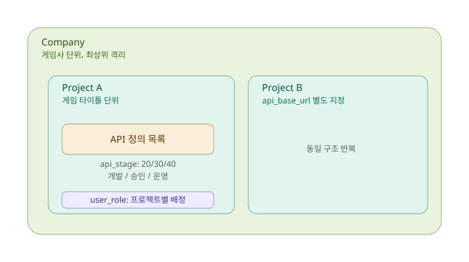
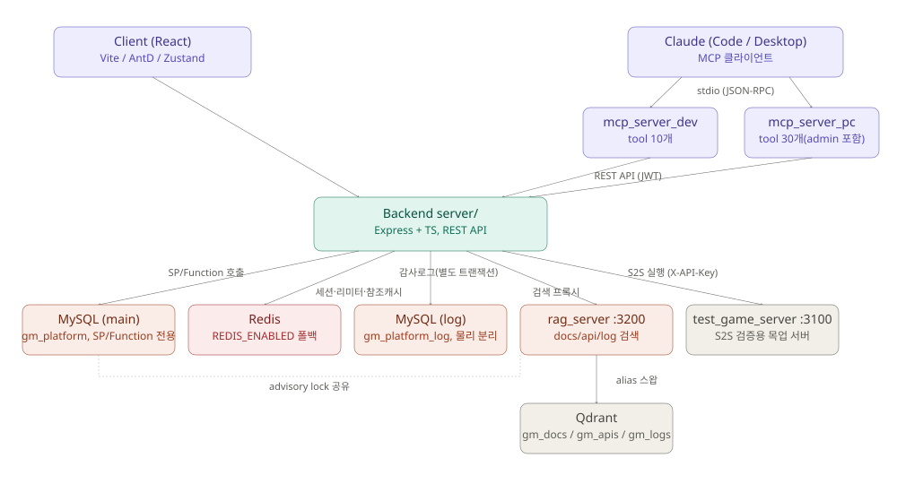

# GM Platform

> 게임 서비스 운영을 위한 데이터 기반 GM-Tool 플랫폼

---

## 요약

- **한 줄 요약**: 백엔드 개발자가 프론트엔드 코드 없이 API 정의만으로 GM-Tool 화면을 자동 생성하는 멀티테넌트(회사→프로젝트→API) 운영 플랫폼
- **핵심 스택**: Node.js 22 + Express + TypeScript + MySQL 8.4(Stored Procedure/Function 전용) · React 18 + Vite + Ant Design · Qdrant + 로컬 임베딩(RAG 검색) · MCP(Claude Code/Desktop 연동)
- **정량 성과**: API 통합 테스트 **764/764 PASS**(3회 반복) · MCP tool 역할별 게이팅 SUPER_ADMIN 33개/DEVELOPER 23개/APPROVER 16개/OPERATOR 12개 · RAG 임베딩 모델 교체로 "기술 스택" 질의 순위 471위→2위(코퍼스 1093건 기준) 개선

---

## 목차

- [요약](#요약)
- [왜 만들었나](#왜-만들었나)
- [핵심 아이디어](#핵심-아이디어)
- [다중 서비스 통합 운영](#다중-서비스-통합-운영)
- [기술적 도전과 해결](#기술적-도전과-해결)
- [기술 스택](#기술-스택)
- [주요 기능](#주요-기능)
- [문서 목록](#문서-목록)
- [프로젝트 구조](#프로젝트-구조)
- [AI 활용](#ai-활용)
- [현재 상태](#현재-상태)
- [한계 및 개선 과제](#한계-및-개선-과제)
- [라이선스](#라이선스)

---

## 왜 만들었나

- 게임 서비스 운영에는 아이템 지급·유저 제재·캐시 지급 등을 처리하는 내부 관리 도구(**GM-Tool**)가 반드시 필요하다
- 이 도구는 통상 백엔드 개발자가 게임 서버 API 설계와 동시에 프론트엔드까지 구현해야 하는데, 대부분의 백엔드 개발자는 프론트엔드 경험이 충분하지 않다
- GM Platform은 **API 요청/응답 파라미터를 데이터로 등록하면 입력 폼과 결과 화면이 자동 렌더링**되도록 설계해 이 문제를 해결한다 — 프론트엔드 코드를 한 줄도 작성하지 않고 새 GM 기능을 추가할 수 있다

---

## 핵심 아이디어

- GM-Tool 작업의 대부분은 `입력 폼 → 게임 서비스 API 호출 → 결과 확인` 구조로 동일하고, 달라지는 것은 파라미터 종류뿐
- API의 요청 파라미터를 등록하면 입력 폼이 자동 렌더링됨
- API의 응답 파라미터를 등록하면 결과 화면이 자동 구성됨
- 컴포넌트 타입(텍스트/숫자/날짜/셀렉트/라디오/체크박스)을 선택하면 그에 맞는 UI가 생성됨

---

## 다중 서비스 통합 운영

- 회사 → 프로젝트 → API 계층 구조로 데이터 모델을 설계해, 회사 단위로 하위 리소스(프로젝트/API 정의/사용자/권한/감사 로그) 전체가 격리됨
- 게임사가 여러 타이틀을 운영해도 하나의 플랫폼에서 통합 관리 가능 — 타이틀마다 별도 GM-Tool을 유지하지 않아도 됨
- 회사 단위 격리가 데이터 모델에 이미 반영돼 있어, 여러 고객사가 하나의 플랫폼을 공유하는 SaaS 형태로 확장할 때도 테이블 구조를 크게 바꾸지 않고 접근 가능 (단, 실제 SaaS 온보딩/과금 흐름은 미구현 — [한계 및 개선 과제](#한계-및-개선-과제) 참고)



---

## 기술적 도전과 해결

프로젝트 진행 중 실제로 부딪힌 기술적 난제와 해결 과정을 요약한다. 각 항목의 상세 설계 근거는 [기술 스택](#기술-스택) 섹션과 `docs/`에도 남아있다(중복 허용 — 이 섹션은 요약본).

### 1. 세션 무효화 — JWT와 user_session 병행

- **문제**: JWT만 쓰면 발급된 토큰은 만료 전까지 서버가 강제로 무효화할 방법이 없다
- **왜 어려웠는가**: 운영 도구 특성상 계정 정지·권한 변경·강제 로그아웃이 **즉시 반영**돼야 하는데, stateless 토큰 검증만으로는 이를 충족할 수 없다
- **해결**: JWT는 API 인증(stateless 검증)에만 쓰고, `user_session` 테이블로 세션 단위 무효화 여부를 DB에서 재확인. 이후 Redis user-generation 카운터 캐싱을 도입해 매 요청 DB 조회 비용을 없애면서도 로그아웃/비밀번호 변경/계정 상태 변경 시 해당 사용자의 캐시된 세션 전체가 다음 조회에서 즉시 무효화되도록 함
- **결과**: 로그아웃 직후 같은 access token 재사용 시 즉시 차단(10009), 세션 A에서 비밀번호 변경 시 세션 B도 즉시 차단(cross-session 무효화)까지 라이브 검증

### 2. 프로젝트 단위 권한 재검증 — TOCTOU 레이스

- **문제**: JWT의 `role_code`는 로그인 시점 "가진 프로젝트 중 최고 권한"(MIN) 하나로 고정된다 — A프로젝트 DEVELOPER가 B프로젝트에서도 DEVELOPER 권한을 행세할 수 있는 구조적 허점
- **왜 어려웠는가**: 서비스 레이어가 별도 SP 호출로 권한을 검증한 뒤 실제 쓰기 SP를 또 호출하는 2단계(check-then-act) 구조였는데, 그 사이 관리자가 권한을 회수해도 이미 시작된 요청은 통과되는 TOCTOU 레이스 창이 있었다
- **해결**: 권한 재검증을 SP 내부로 이관해 "검증+쓰기"를 단일 트랜잭션으로 원자화. 반복되는 검증 로직은 `FN_GET_PROJECT_ROLE_CODE`/`FN_IS_PROJECT_DEVELOPER` 등 재사용 가능한 Function으로 공용화해 API/CodeGroup/CodeItem/ProjectConnection/ApiKey 등 12개 SP에 동일 패턴 적용
- **결과**: TOCTOU 창 자체를 제거(기존 스코핑 회귀 테스트로 검증). 이 리팩터링 과정에서 Function 재사용 중 실제 NULL 비교 권한우회 버그를 실측으로 발견해 함께 수정. 전체 API 통합 테스트 3회 반복 **764/764 PASS**

### 3. RAG 검색 품질 — 임베딩 모델 anisotropy(hubness)

- **문제**: "기술 스택"처럼 짧고 일반적인 한국어 질의에서, 정답 청크가 아니라 의미상 무관한 청크가 검색 결과 상위권을 차지
- **왜 어려웠는가**: 원인이 청킹 전략(마크다운 표 형태 텍스트, 긴 청크 안에 여러 소주제 혼합)인지 임베딩 모델 자체의 한계인지 구분이 안 됐다 — 표를 평문화하고 소주제 단위로 청크를 재분리했는데도 근본 해결이 안 됐다
- **해결**: 코사인 유사도를 직접 비교하는 실측 스크립트로 원인을 모델 자체의 anisotropy(hubness)로 좁힌 뒤, 검색(retrieval) 목적으로 학습된 `Xenova/multilingual-e5-base`(768차원, `query:`/`passage:` 비대칭 프리픽스)로 교체
- **결과**: "기술 스택" 질의 순위 471위/1093 → 2위, "테크스택" 461위 → 1위. 기존에 잘 되던 질의도 스코어 분포가 0.2~0.7(넓고 애매함) → 0.77~0.88(좁고 선명함)로 개선

### 4. 외부 API 인증(X-API-Key) — 발급·암호화·자동폐기

- **문제**: GM Platform이 외부 게임서버 API를 호출할 때 인증 수단이 없어, 엔드포인트만 알면 누구나 호출 가능한 상태였다
- **왜 어려웠는가**: 키를 평문 저장/노출하면 유출 위험이 있고, 서버 주소(`api_base_url`)가 바뀌었는데 옛 키가 계속 유효하면 잘못된 대상에 키가 노출된 채로 남는 문제도 있었다
- **해결**: GM Platform이 직접 키를 발급(`crypto.randomBytes(32)`)해 AES-256-CBC로 암호화 저장, 평문은 발급 응답에 1회만 노출(GitHub PAT 패턴). 호출 직전에만 복호화해 헤더에 붙이고 즉시 버림. `api_base_url` 변경 시 같은 트랜잭션에서 저장된 키를 자동 NULL 폐기
- **결과**: 정상 키 통과(status=40 SUCCESS)·키 불일치 차단(status=50, 401)까지 라이브 검증. 발급/연결정보 변경 동시 레이스는 낙관적 동시성 가드(32002, HTTP 409)로 방어

---

## 기술 스택

**시스템 아키텍처**



**Backend**

| 항목        | 스택                           |
| ----------- | ------------------------------ |
| Runtime     | Node.js 22 LTS                 |
| Framework   | Express + TypeScript           |
| Database    | MySQL 8.4                      |
| Data Access | mysql2 (Stored Procedure/Function 전용) |
| 인증        | JWT (HS256) + user_session     |
| 비밀번호    | bcrypt (rounds=12)             |
| S2S 호출    | HTTP/HTTPS POST (JSON Payload) |
| 로깅        | log_audit + log4js             |
| API 문서    | Swagger UI (swagger-jsdoc)     |

> **JWT + user_session을 함께 쓰는 이유**
> JWT만 사용하면 발급된 토큰이 만료되기 전까지는 서버가 강제로 무효화할 방법이 없다. 하지만 운영 도구 특성상 계정 정지, 권한 변경, 강제 로그아웃처럼 **즉시 반영되어야 하는 상황**이 자주 발생한다. 그래서 JWT는 API 인증(stateless 검증)에 사용하고, `user_session`을 별도로 두어 세션 단위로 무효화 여부를 확인함으로써 토큰이 살아있어도 서버 쪽에서 즉시 접근을 차단할 수 있도록 했다. 세션 무효화가 핵심 이유다.

> **DB 접근을 Stored Procedure/Function으로만 강제하는 이유**
> 애플리케이션 레이어가 SQL을 직접 조립하지 않으므로 SQL Injection 자체가 구조적으로 발붙일 자리가 없다. 더 중요한 이유는 권한 검증의 마지막 방어선을 DB에 두기 위함이다 — 이 프로젝트는 "요청자가 특정 프로젝트에 실제로 권한이 있는가"를 서비스 레이어에서도 판단하지만, SP 내부에서도 호출자의 역할·배정 여부를 DB에서 다시 조회해 재검증한다. 앱 레이어의 버그나 우회 호출이 있어도 DB가 마지막에 한 번 더 걸러내는 구조다. 여러 단계로 나뉜 검증·쓰기를 앱 레이어(ORM이든 직접 조립한 SQL이든)에서 별도 왕복으로 처리하면 그 사이 시간차를 노린 TOCTOU 레이스가 생기기 쉬운데, 이 프로젝트도 실제로 겪었다 — 검증과 쓰기를 SP 하나(단일 트랜잭션)로 합치고 나서야 해결됐다.

**Frontend**

| 항목      | 스택                  |
| --------- | --------------------- |
| Framework | React 18 + TypeScript |
| Build     | Vite                  |
| UI        | Ant Design             |
| 폼        | Ant Design Form       |
| 상태 관리 | Zustand               |
| HTTP      | Axios                 |

**MCP 서버** (`mcp_server_dev/`, `mcp_server_pc/`)

| 항목      | 스택                                |
| --------- | ------------------------------------ |
| Runtime   | Node.js 22 LTS + TypeScript           |
| Protocol  | MCP (Model Context Protocol, stdio)   |
| SDK       | `@modelcontextprotocol/sdk`           |
| 입력 검증 | Zod                                  |
| HTTP      | Axios (GM Platform REST API 호출)     |
| 로깅      | log4js                               |

> LLM(Claude Code / Claude Desktop)이 GM Platform을 자연어로 조작할 수 있도록 REST API를 MCP tool로 감싼 stdio 서버. 로그인 계정의 `role_code`에 따라 노출 tool을 동적으로 게이팅한다.

**RAG 서버** (`rag_server/`)

| 항목      | 스택                                                       |
| --------- | ------------------------------------------------------------ |
| Runtime   | Node.js 22 LTS + TypeScript                                  |
| Framework | Express                                                      |
| Vector DB | Qdrant 1.11.0                                                |
| 임베딩    | `@xenova/transformers` (multilingual-e5-base, 로컬 추론)     |
| DB        | mysql2 (advisory lock 전용 — 스키마 직접 접근 없음)          |
| 로깅      | log4js                                                       |

> 설계 문서(`docs/*.md`+`README.md`)를 자연어로 검색하는 독립 서비스. GM Platform 스키마를 모르는 별도 MSA 경계로 설계했고, 재인덱싱은 Qdrant collection alias 원자적 스왑 + MySQL advisory lock으로 안전하게 처리한다.

---

## 주요 기능

<!-- 스크린샷: 로그인 화면 -->
<!--  -->

- **회사 / 프로젝트 관리 (Multi-tenant Architecture)** — 회사 단위로 하위 리소스 전체가 격리되는 다중 테넌트 구조

<!-- 스크린샷: 회사/프로젝트 목록 화면 -->
<!--  -->

- **사용자 관리 (RBAC)** — 가입 승인 워크플로우 / 역할 기반 권한(SUPER_ADMIN / DEVELOPER / APPROVER / OPERATOR), 프로젝트별 실제 권한 재검증
- **API 정의** — 요청/응답 파라미터 등록으로 자동 UI 생성

<!-- 스크린샷: API 정의 화면 -->
<!--  -->

- **API 실행 / 승인 워크플로우 (API Execution Management / Approval Workflow)** — 즉시 실행 또는 OPERATOR → 승인자 2단계 실행

<!-- 스크린샷: API 실행 워크스페이스 -->
<!--  -->

- **공통 코드 관리** — 셀렉트/라디오/체크박스 데이터 소스 관리
- **감사 로그 (Audit Logging)** — 모든 운영 데이터 변경 이력 Append-Only 기록(변경 전/후 JSON 포함)

<!-- 스크린샷: 감사 로그 검색 화면 -->
<!--  -->

> **즉시 실행 vs 승인 워크플로우 기준**
> 실행 방식은 역할(Role)과 API별 승인 필요 여부(`is_required_approval`) 조합으로 결정된다. `OPERATOR`가 `is_required_approval=1`로 설정된 API를 실행하는 경우에만 직접 실행이 막히고 `SUPER_ADMIN`·`DEVELOPER`·`APPROVER`의 승인을 거쳐 2단계로 처리되며, 그 외(승인 불필요 API이거나 요청자가 `DEVELOPER`/`APPROVER`/`SUPER_ADMIN`인 경우)는 즉시 실행된다. 이는 운영 실수(오지급, 오제재 등)를 승인이 필요한 API에 한해 한 번 더 걸러내기 위한 구조다.

---

## 문서 목록

| 파일                                                | 설명                                       |
| --------------------------------------------------- | ------------------------------------------ |
| [01_GM_PLATFORM_GUIDE.md](docs/01_GM_PLATFORM_GUIDE.md) | 입점 게임사용 소개 및 사용 가이드      |
| [02_TECH_STACK.md](docs/02_TECH_STACK.md)           | 기술 스택 및 환경변수 목록                 |
| [03_DEV_SETUP.md](docs/03_DEV_SETUP.md)             | 로컬 개발 환경 설정                        |
| [04_PROJECT_STRUCTURE.md](docs/04_PROJECT_STRUCTURE.md) | 프로젝트 폴더 구조                     |
| [05_ERD.md](docs/05_ERD.md)                         | Entity Relationship Diagram                |
| [06_DATABASE_SCHEMA.md](docs/06_DATABASE_SCHEMA.md) | 테이블 정의 및 공통 정책                   |
| [07_API_COMMON.md](docs/07_API_COMMON.md)           | API 공통 규약 (인증, 응답 형식, 오류 코드) |
| [08_AUTH_API.md](docs/08_AUTH_API.md)               | 인증 API (로그인, 토큰, 세션, JWT 명세)    |
| [09_API_SPEC_Part1.md](docs/09_API_SPEC_Part1.md)   | Company / Project / User / UserRole API    |
| [10_API_SPEC_Part2.md](docs/10_API_SPEC_Part2.md)   | API / API Request / API Response           |
| [11_API_SPEC_Part3.md](docs/11_API_SPEC_Part3.md)   | API 실행 및 승인 워크플로우                |
| [12_API_SPEC_Part4.md](docs/12_API_SPEC_Part4.md)   | Code Group / Code Item                     |
| [13_API_SPEC_Part5.md](docs/13_API_SPEC_Part5.md)   | 감사 로그                                  |
| [14_MENU_PERMISSION.md](docs/14_MENU_PERMISSION.md) | 역할별 메뉴 접근 권한                      |
| [15_SCREEN_LIST.md](docs/15_SCREEN_LIST.md)         | 화면 목록 및 연관 API                      |
| [16_LAYOUT.md](docs/16_LAYOUT.md)                   | 공통 레이아웃 구조                         |
| [17_FRONTEND_BUILD_PLAN.md](docs/17_FRONTEND_BUILD_PLAN.md) | 프론트엔드 구현 계획 (Stage 0~7)       |
| [18_TEST_GAME_SERVER.md](docs/18_TEST_GAME_SERVER.md) | API 실행 검증용 테스트 게임서버            |
| [19_MCP_SERVER_DEV.md](docs/19_MCP_SERVER_DEV.md)   | GM Platform을 LLM이 조작하는 MCP 서버       |
| [20_MCP_SERVER_PC.md](docs/20_MCP_SERVER_PC.md)     | 회사/프로젝트/사용자 admin 관리까지 포함한 MCP 서버 |
| [21_RAG_SERVER.md](docs/21_RAG_SERVER.md)           | 설계 문서 자연어 검색 RAG 서버 (Qdrant + 로컬 임베딩) |

---

## 프로젝트 구조

```
gm_platform/
├── client/            # Frontend (React)
├── server/            # Backend (Express)
├── test_game_server/  # GM Platform API 실행 검증용 테스트 게임서버 (별도 DB/서버, 포트 3100)
├── mcp_server_dev/    # GM Platform을 LLM(Claude Code)이 조작하는 MCP 서버 (stdio, 개발자 자동화)
├── mcp_server_pc/     # mcp_server_dev + 회사/프로젝트/사용자/역할배정 admin 관리 MCP 서버 (stdio)
├── rag_server/        # 설계 문서(docs/) 자연어 검색 RAG 서버 (Qdrant + 로컬 임베딩, 포트 3200)
├── database/
│   ├── tables/        # DDL SQL 파일 (all_tables.sql 포함)
│   └── procedures/    # Stored Procedure SQL 파일
└── docs/              # 설계 문서
```

---

## AI 활용

이 프로젝트는 AI를 개발 보조 도구로 활용한 워크플로우를 실험하기 위해 진행되었다.

요구사항 정의, 아키텍처 설계, 의사결정, 검증은 모두 개발자가 직접 수행하였으며,
AI는 문서 초안 작성과 반복적인 코드 작업의 속도를 높이는 데 활용하였다.

| 도구        | 용도                                    |
| ----------- | ---------------------------------------- |
| ChatGPT     | 설계 아이디어 검토 및 트레이드오프 논의 |
| Claude Code | 문서 초안 작성 및 코드 보조             |

---

## 현재 상태

- ✅ 설계 문서 전체 완료 — DB 설계 / API 명세 / 권한 설계 / 화면 목록 / 레이아웃 (`docs/` 01~16)
- ✅ Backend API 전체 구현 — Auth/Company/Project/User/UserRole/API/APIExecution/CodeGroup/CodeItem/AuditLog, Swagger UI 포함. 통합 테스트 **764/764 PASS**(3회 반복)
- ✅ Frontend 전체 구현 — Stage 0~7 완료([17_FRONTEND_BUILD_PLAN.md](docs/17_FRONTEND_BUILD_PLAN.md)), 프로덕션 빌드 검증까지 완료
- ✅ 테스트 게임서버 구축 완료 — API 7개 등록, 즉시실행/승인대기 흐름 라이브 검증 ([18_TEST_GAME_SERVER.md](docs/18_TEST_GAME_SERVER.md))
- ✅ MCP 서버 구현 완료 — mcp_server_dev(role 기반 tool 게이팅) + mcp_server_pc(admin CRUD 확장), Claude Code·Claude Desktop 양쪽 연결 검증 ([19](docs/19_MCP_SERVER_DEV.md)·[20_MCP_SERVER_PC.md](docs/20_MCP_SERVER_PC.md))
- ✅ 외부 API 인증(X-API-Key) 구현 완료 — 발급/암호화/자동폐기 구조([기술적 도전과 해결](#기술적-도전과-해결) 참고)
- ✅ RAG 서버 구현 완료 — 문서(Phase 1)/API 정의(Phase 2)/감사로그(Phase 3) 3단계 자연어 검색, Qdrant + 로컬 임베딩, 프로젝트·회사 단위 접근제어 이식 ([21_RAG_SERVER.md](docs/21_RAG_SERVER.md))

---

## 한계 및 개선 과제

- **RAG 인덱싱 범위** — `CLAUDE.md`(내부 비공개 문서, `.gitignore` 대상)는 검색 인덱싱 대상에서 제외됨. 인덱싱하려면 신뢰된 내부망 배치, GM Platform 경유 조회의 인증 경계 등을 별도로 설계해야 함
- **프로덕션 배포 파이프라인 부재** — 로컬/개발 환경까지만 검증됨. CI/CD, 프로세스 매니저(pm2/systemd 등) 도입 및 실서비스 배포 절차 미구축
- **단위 테스트 프레임워크 부재** — PowerShell 통합 테스트 스크립트(`tests/api_test.ps1`)로 전체 API를 3회 반복 검증하고 있으나, Jest/Vitest 등 함수 단위 테스트는 없음
- **로그인 리미터의 인스턴스 분리** — `express-rate-limit`의 인메모리 카운팅이 인스턴스별로 분리돼, 스케일아웃 시 실효 리밋이 인스턴스 수만큼 완화됨(Redis 공유 store로의 전환은 보류 상태)
- **로그 파일 중앙화 미해결** — 여러 인스턴스로 나뉜 로그 파일을 한 곳에서 조회하는 별도 수집기(Filebeat/Fluentd 등) 미도입
- **감사로그 검색의 hubness 잔존** — 문서/API 검색은 임베딩 모델 교체로 개선됐으나, 한 필드짜리 극도로 짧고 정형화된 diff 문장(예: `api_stage: 20 → 40`)은 여전히 허브 현상으로 무관한 결과가 상위권에 뜰 수 있음. 완전 해결에는 모델 교체 이상의 청크 재설계가 필요할 것으로 판단해 보류
- **세션 role_code의 MIN 고정** — 한 세션의 `role_code`는 로그인 시점 "가진 프로젝트 중 최고 권한" 하나로 고정된다. 다른 프로젝트에서의 실제 역할이 더 높아도 재로그인 전까지는 반영되지 않음(감사로그 조회 스코핑 등 일부 기능에 영향)
- **SaaS 멀티테넌트 미구현** — 회사 단위 데이터 격리는 데이터 모델에 반영돼 있으나, 여러 고객사가 하나의 배포를 공유하는 온보딩/과금 흐름은 실제로 구현되지 않음

---

## 라이선스

이 프로젝트는 포트폴리오/학습 목적으로 공개됩니다. 개인적인 학습·열람·참고 용도로는 자유롭게 사용할 수 있으나, 상업적 이용(영리 목적 사용, 재배포, 상용 서비스에의 포함 등)은 금지됩니다. 자세한 내용은 [LICENSE.md](LICENSE.md)를 참고하세요.
