# 01_GM_PLATFORM_GUIDE.md

# GM Platform 소개 및 사용 가이드

입점(연동) 게임사 담당자를 위한 문서입니다. GM Platform이 무엇인지, 어떻게 가입하고 로그인하는지, 역할별로 화면에서 무엇을 할 수 있는지, 그리고 여러분의 게임서버를 GM Platform에 연동하려면 백엔드 개발자가 무엇을 해야 하는지를 이 문서 하나로 다룹니다.

---

## 목차

1. [GM Platform이란?](#1-gm-platform이란)
2. [시작하기](#2-시작하기)
   - [2.1 계정 발급 절차](#21-계정-발급-절차)
   - [2.2 계정 상태](#22-계정-상태)
3. [화면 기본 구성](#3-화면-기본-구성)
4. [역할과 할 수 있는 일](#4-역할과-할-수-있는-일)
5. [관리 업무 (SUPER_ADMIN·DEVELOPER)](#5-관리-업무-super_admindeveloper)
   - [5.1 회사·프로젝트](#51-회사프로젝트)
   - [5.2 사용자·권한](#52-사용자권한)
   - [5.3 공통코드 관리](#53-공통코드-관리)
   - [5.4 API 정의 등록](#54-api-정의-등록)
   - [5.5 게임서버 연동 정보 관리](#55-게임서버-연동-정보-관리)
6. [실행 업무 (전체 역할)](#6-실행-업무-전체-역할)
   - [6.1 API 실행](#61-api-실행)
   - [6.2 실행 이력](#62-실행-이력)
   - [6.3 승인 대기 처리 (SUPER_ADMIN·DEVELOPER·APPROVER)](#63-승인-대기-처리-super_admindeveloperapprover)
7. [감사 로그 (SUPER_ADMIN·DEVELOPER·APPROVER)](#7-감사-로그-super_admindeveloperapprover)
8. [게임서버 개발자를 위한 연동 안내](#8-게임서버-개발자를-위한-연동-안내)
   - [8.1 API 계약](#81-api-계약)
   - [8.2 X-API-Key 검증 붙이기](#82-x-api-key-검증-붙이기)
   - [8.3 API 등록 절차 요약 (체크리스트)](#83-api-등록-절차-요약-체크리스트)
9. [자주 묻는 질문](#9-자주-묻는-질문)
10. [문의](#10-문의)

---

# 1. GM Platform이란?

GM Platform은 여러 게임 서비스를 **하나의 관리 도구**로 운영하기 위한 GM-Tool(운영 도구) 플랫폼입니다.

아이템 지급, 유저 상태 변경, 캐시 지급, 이벤트 적용처럼 운영 담당자(GM)가 게임 서버에 직접 명령을 내려야 하는 작업들을, 매번 새로운 화면을 개발하지 않고도 **데이터로 화면을 구성**해서 처리할 수 있게 해줍니다.

```
게임사가 API를 등록 → GM Platform이 입력 폼과 결과 화면을 자동으로 만들어줌 → 운영자는 폼만 채우고 실행
```

즉, 여러분의 게임서버가 "이런 API가 있고, 이런 파라미터를 받는다"는 정보만 GM Platform에 등록하면, 프론트엔드 화면을 따로 만들지 않아도 운영팀이 바로 사용할 수 있는 GM-Tool이 만들어집니다.

회사 → 프로젝트(게임 타이틀) → API 계층 구조로 데이터가 격리되어 있어, 여러 게임 타이틀을 하나의 계정 체계로 통합 운영할 수도 있습니다.

---

# 2. 시작하기

## 2.1 계정 발급 절차

GM Platform은 사내 인원만 사용하는 폐쇄형 도구라, 아무나 회원가입만으로 즉시 사용할 수는 없습니다.

1. GM Platform 운영 담당자(SUPER_ADMIN)에게 **회사코드**(및 필요 시 프로젝트코드)를 요청합니다.
2. `/signup` 화면에서 회원가입을 신청합니다. 이때 회사코드/프로젝트코드는 드롭다운이 아니라 **직접 입력**합니다 — 로그인 전 화면이라 전체 회사·프로젝트 목록을 공개하지 않기 위한 설계입니다.
3. 가입 신청 직후 계정 상태는 **가입승인대기**입니다. SUPER_ADMIN이 승인해야 로그인할 수 있습니다.
4. 승인이 완료되면 등록한 아이디/비밀번호로 로그인합니다.

| 로그인 화면 (그림 1) | 회원가입 화면 (그림 2) |
| --- | --- |
| 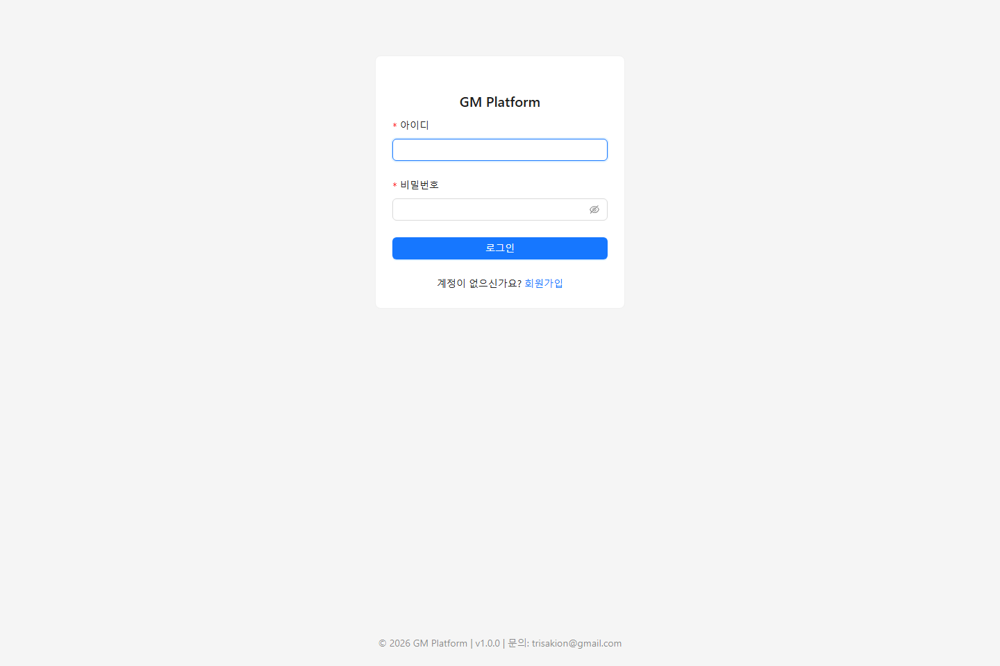 | 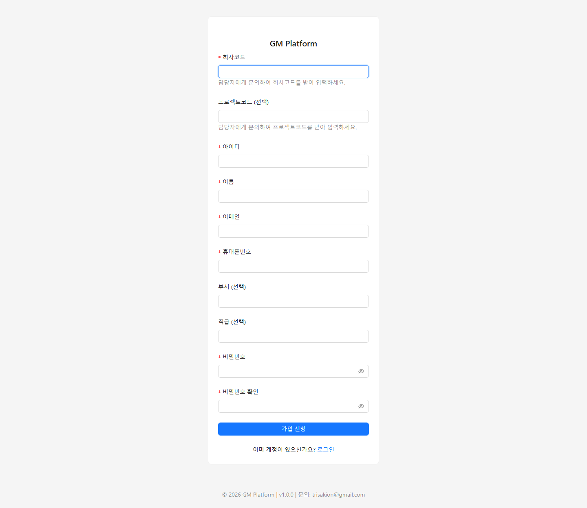 |

## 2.2 계정 상태

| 값 | 의미 | 로그인 가능 여부 |
| --- | --- | --- |
| 0 | 가입승인대기 | 불가 |
| 1 | 정상 | 가능 |
| 2 | 가입반려 | 불가 |
| 3 | 사용중지 | 불가 |

가입이 반려되었더라도 관리자가 상태를 "승인대기"로 되돌려주면 같은 아이디로 다시 승인 절차를 밟을 수 있습니다.

---

# 3. 화면 기본 구성

로그인하면 아래와 같은 공통 레이아웃이 나옵니다.

- **헤더**: 왼쪽에 회사/프로젝트 선택 콤보박스가 있습니다. SUPER_ADMIN만 "전체 회사"/"전체 프로젝트"를 선택할 수 있고, 그 외 역할은 본인 소속 회사로 고정됩니다. 대부분의 화면(목록 조회, API 실행 등)은 여기서 선택한 프로젝트를 기준으로 동작하므로, **원하는 프로젝트가 먼저 선택되어 있는지 항상 확인**하세요.
- **사이드바**: "관리" 메뉴(회사/프로젝트/사용자/코드그룹/API 정의/감사로그 — 역할에 따라 일부만 보임)와, 실제 운영 업무를 위한 일반 메뉴(API 실행/실행이력/승인대기)로 나뉩니다.
- **내 계정**: 헤더 우측의 아바타를 클릭하면 내 정보 조회, 비밀번호 변경, 로그아웃 메뉴가 나옵니다. 비밀번호를 변경하면 보안을 위해 그 즉시 모든 세션이 종료되므로, 변경 직후에는 다시 로그인해야 합니다.
- 관리 화면(등록·수정·상세)에 들어가 있는 동안에는 실수로 다른 프로젝트를 보고 있다고 착각하지 않도록 헤더의 회사/프로젝트 선택이 잠깁니다. 목록 화면에서만 자유롭게 바꿀 수 있습니다.

---

# 4. 역할과 할 수 있는 일

GM Platform은 4단계 역할을 사용합니다. 한 사용자가 **프로젝트마다 다른 역할**을 가질 수 있습니다(예: A 게임에서는 개발자, B 게임에서는 운영자).

| 역할 | 코드 | 한 줄 설명 |
| --- | --- | --- |
| SUPER_ADMIN | 10 | 전체 회사·프로젝트 관리자. 계정 승인, 회사/프로젝트 생성 등 플랫폼 자체를 관리 |
| DEVELOPER | 20 | 그 프로젝트(게임)의 실제 개발 담당자. API 정의 등록, 게임서버 연동 정보 관리, 공통코드 관리 |
| APPROVER | 30 | 승인이 필요한 운영 작업을 검토·승인/반려 |
| OPERATOR | 40 | 실제 GM 업무(아이템 지급, 유저 제재 등)를 수행하는 운영 담당자 |

역할별로 어떤 기능에 접근할 수 있는지 요약하면 다음과 같습니다.

| 기능 | SUPER_ADMIN | DEVELOPER | APPROVER | OPERATOR |
| --- | :---: | :---: | :---: | :---: |
| 회사·프로젝트 등록/수정 | O | - | - | - |
| 회사 목록/상세 조회 | O (전체) | O (본인 소속 회사만) | O (본인 소속 회사만) | O (본인 소속 회사만) |
| 프로젝트 목록/상세 조회 | O (전체) | O (역할보유 프로젝트만) | O (역할보유 프로젝트만) | O (역할보유 프로젝트만) |
| 사용자 가입 승인/반려, 권한 부여 | O | - | - | - |
| 사용자 목록 조회 | O (전체) | O (본인 회사만) | - | - |
| 공통코드 관리 | O | O | - | - |
| API 정의 등록/수정 | O | O | - | - |
| API 실행 — api_stage 개발 | O | O | - | - |
| API 실행 — api_stage 승인 | O | O | O | - |
| API 실행 — api_stage 운영 | O | O | O | O |
| 실행 승인/반려 | O | O | O | - |
| 실행 이력 조회 | O (전체) | O (자사만) | O (자사만) | O (본인 요청건만) |
| 감사 로그 조회 | O (전체) | O (자사만) | O (자사만) | - |

이 문서에서는 이 표를 바탕으로 실무에서 자주 쓰는 흐름 위주로 안내합니다.

---

# 5. 관리 업무 (SUPER_ADMIN·DEVELOPER)

## 5.1 회사·프로젝트

SUPER_ADMIN이 회사와 프로젝트(게임 타이틀)를 등록합니다. 프로젝트는 "회사 소속의 게임 하나"에 대응하며, 게임서버 연동 정보(`API Base URL`, `X-API-Key`)도 프로젝트 단위로 관리됩니다. 상세 화면 하단에는 이 연동 정보와 API 키 발급 상태도 함께 표시되는데, 자세한 발급 절차는 5.5에서 이어서 다룹니다.

| 목록 (그림 3) | 상세 (그림 4) |
| --- | --- |
| 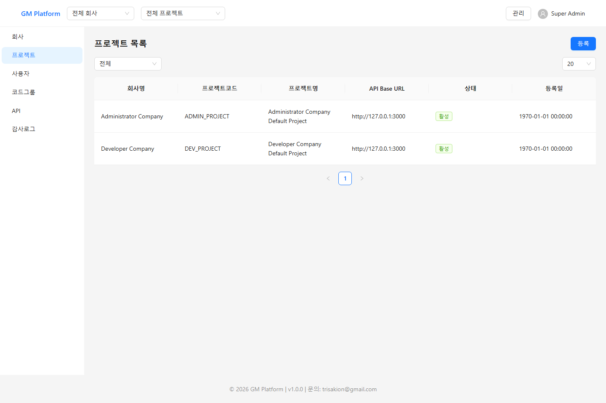 | 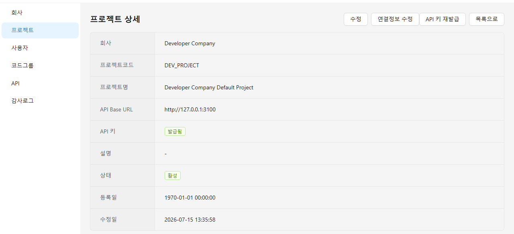 |

## 5.2 사용자·권한

SUPER_ADMIN은 가입 신청을 승인/반려하고, 사용자별로 프로젝트마다 다른 역할(DEVELOPER/APPROVER/OPERATOR)을 부여합니다. DEVELOPER는 본인 소속 회사의 사용자 목록을 조회할 수 있습니다.

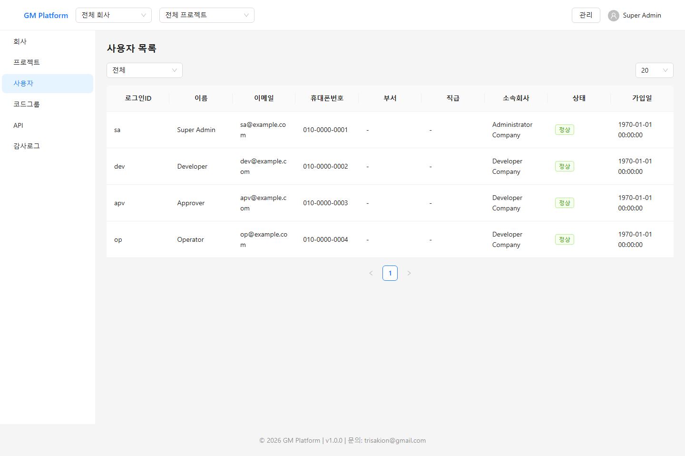
*그림 5. 사용자 목록*

## 5.3 공통코드 관리

SELECT/RADIO/CHECKBOX 형태로 입력받는 API 파라미터(예: 성별, 재화 종류)는 값을 하나하나 하드코딩하지 않고 **공통코드**로 등록해두고 재사용합니다. 코드그룹과 그 안의 코드아이템을 엑셀처럼 한 화면에서 등록·수정합니다.

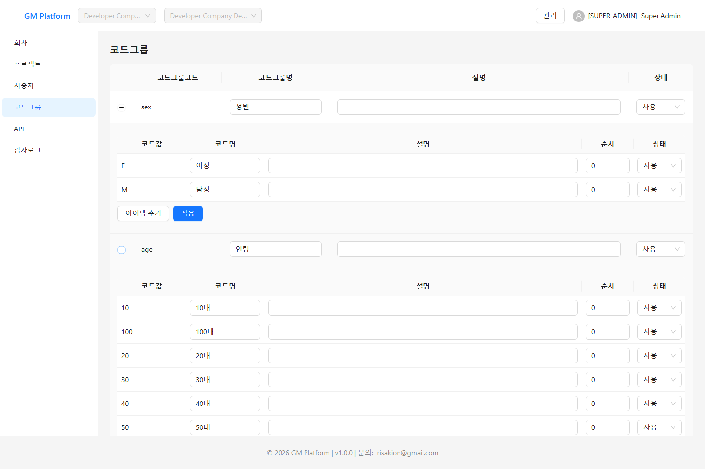
*그림 6. 코드그룹 관리*

## 5.4 API 정의 등록

게임서버가 제공하는 기능(엔드포인트) 하나하나를 GM Platform에 "API"로 등록합니다. 각 API는 다음 정보를 가집니다.

- **기본정보**: API 코드/이름, Endpoint(예: `/v1/game/give-item`), 승인 필요 여부, 응답 표시 방식(KEY_VALUE 또는 GRID), **운영 단계**(`api_stage`: 개발/승인/운영 — 단계가 낮을수록 실행 가능한 역할이 좁아지는 안전장치입니다. 자세한 기준은 8.3 참고)
- **Request 파라미터**: 실행 화면에 자동 생성될 입력 폼의 각 필드(텍스트/숫자/날짜/셀렉트/라디오/체크박스 등)
- **Response 파라미터**: 실행 결과 화면에 표시할 응답 필드

| API 등록 (그림 7) | Request 파라미터 (그림 8) |
| --- | --- |
| 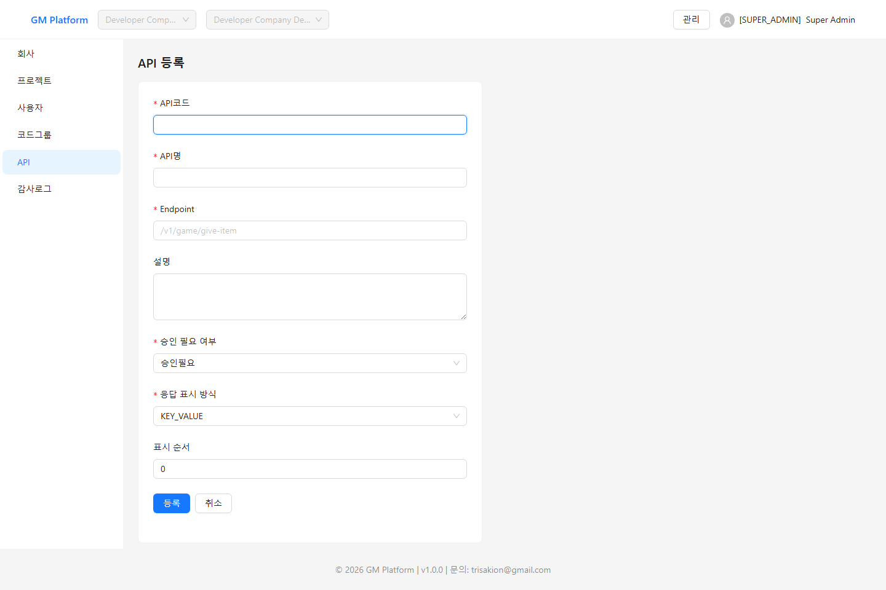 | 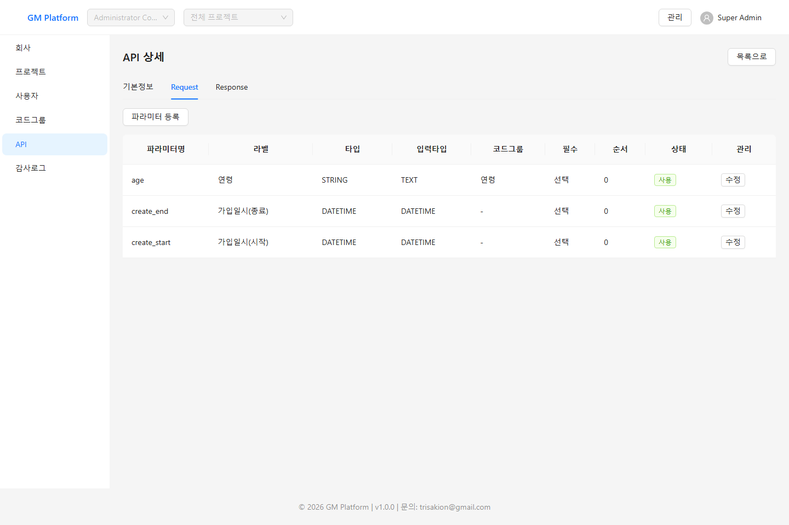 |

승인 필요 여부(`is_required_approval`)를 켜두면, OPERATOR가 이 API를 실행할 때 즉시 실행되지 않고 SUPER_ADMIN·DEVELOPER·APPROVER의 승인을 거쳐야 실제로 게임서버에 호출됩니다. 오지급·오제재처럼 되돌리기 어려운 작업에 사용하는 안전장치입니다.

## 5.5 게임서버 연동 정보 관리

프로젝트 상세 화면(그림 4, API 키가 이미 발급된 상태)에서 게임서버 연동에 필요한 두 가지를 관리합니다.

- **API Base URL**: 여러분의 게임서버 주소. GM Platform은 API 실행 시 항상 `{API Base URL}{Endpoint}`로 POST 요청을 보냅니다.
- **API 키(X-API-Key)**: GM Platform이 발급하는 인증 키. 여러분의 게임서버는 이 키로 "GM Platform이 보낸 요청이 맞는지" 검증합니다.

두 항목 모두 SUPER_ADMIN뿐 아니라 **그 프로젝트에 실제 DEVELOPER 권한을 가진 담당자**가 직접 관리할 수 있습니다 — 실제로 게임서버를 만드는 쪽이 SUPER_ADMIN을 거치지 않고 스스로 설정을 관리할 수 있어야 한다는 판단입니다. 다른 프로젝트의 DEVELOPER는 이 프로젝트를 건드릴 수 없습니다.

### API 키 발급 방법

1. "API 키 발급"(최초) 또는 "API 키 재발급"(이미 발급된 경우) 버튼을 누릅니다.
2. 재발급인 경우, 기존 키가 즉시 무효화된다는 확인창이 뜹니다.

   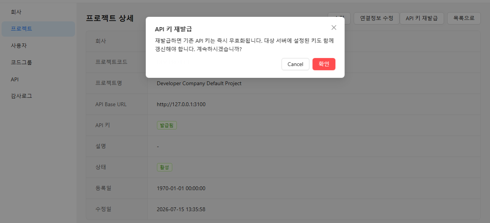
   *그림 9. API 키 재발급 확인창*

3. 확인을 누르면 새 키가 생성되고, **이번 한 번만** 평문으로 화면에 표시됩니다.

   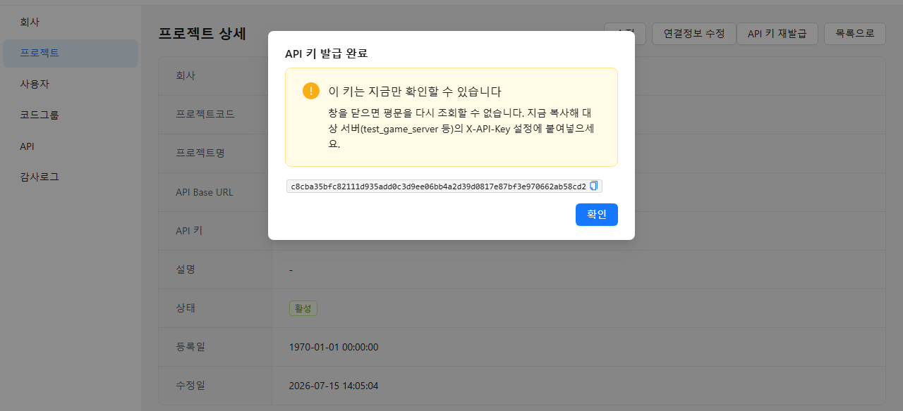
   *그림 10. 발급된 API 키 1회 노출 화면*

4. 이 값을 복사해 **여러분의 게임서버 설정(환경변수 등)에 그대로 붙여넣습니다.** 창을 닫으면 이후로는 GM Platform 어디에서도 평문을 다시 확인할 수 없습니다(발급 여부만 "발급됨" 배지로 표시).
5. 키를 분실했거나 유출이 의심되면 다시 "재발급"을 눌러 새 키로 교체하면 됩니다. 이전 키는 즉시 사용할 수 없게 됩니다.

> **주의**: API Base URL을 변경하면 그 프로젝트에 발급되어 있던 API 키는 **자동으로 폐기**됩니다(대상 서버가 바뀌었는데 예전 키를 그대로 쓰는 실수를 막기 위함). 이 경우 상세 화면에 재발급 안내 배너가 표시되니, 서버 주소를 바꾼 뒤에는 API 키도 반드시 재발급해서 게임서버에 다시 설정해야 합니다.

게임서버 쪽에서 이 키를 실제로 검증하는 방법은 8장을 참고하세요.

---

# 6. 실행 업무 (전체 역할)

## 6.1 API 실행

좌측 사이드바의 "API" 메뉴를 펼치면 현재 프로젝트의 실행 가능한 API 목록이 체크박스로 나열됩니다. 필요한 API를 체크하면 우측에 실행 패널이 열립니다.

| 패널 목록 (그림 11) | Request 입력 후 실행 결과 (그림 12) |
| --- | --- |
| 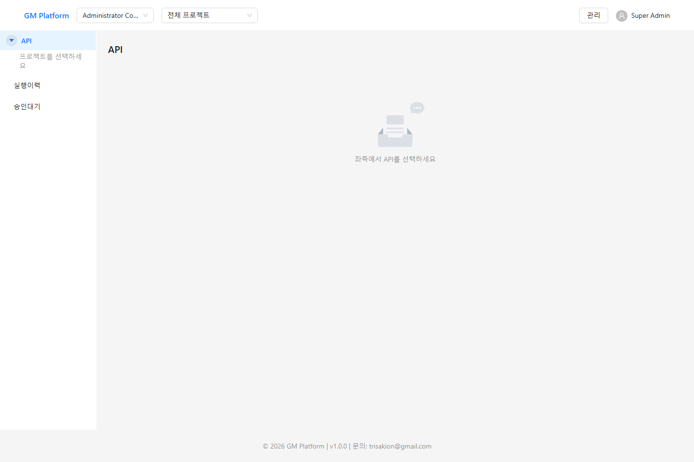 | 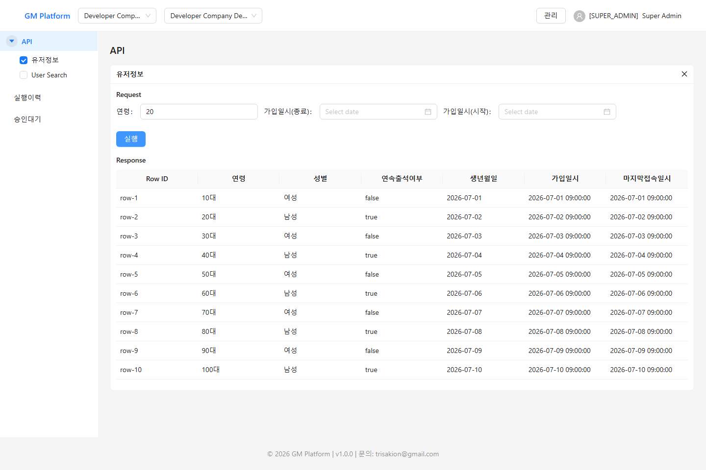 |

여러 API를 동시에 체크해 패널을 나란히 열어두고 작업할 수 있습니다. 파라미터에 SELECT/RADIO/CHECKBOX가 있으면 5.3에서 등록한 공통코드 값이 자동으로 옵션으로 표시됩니다.

승인이 필요 없는 API, 또는 요청자가 SUPER_ADMIN·DEVELOPER·APPROVER 중 하나이면 실행 즉시 게임서버가 호출되고 결과가 바로 표시됩니다. OPERATOR가 승인 필요 API를 실행하면 결과 대신 "승인대기" 상태로 등록됩니다.

## 6.2 실행 이력

내가 실행했거나(OPERATOR는 본인 건만) 소속 회사에서 실행된 API 호출 이력을 조회합니다. 성공/실패, 요청 파라미터, 응답 데이터, 실패 시 에러 메시지까지 확인할 수 있습니다.

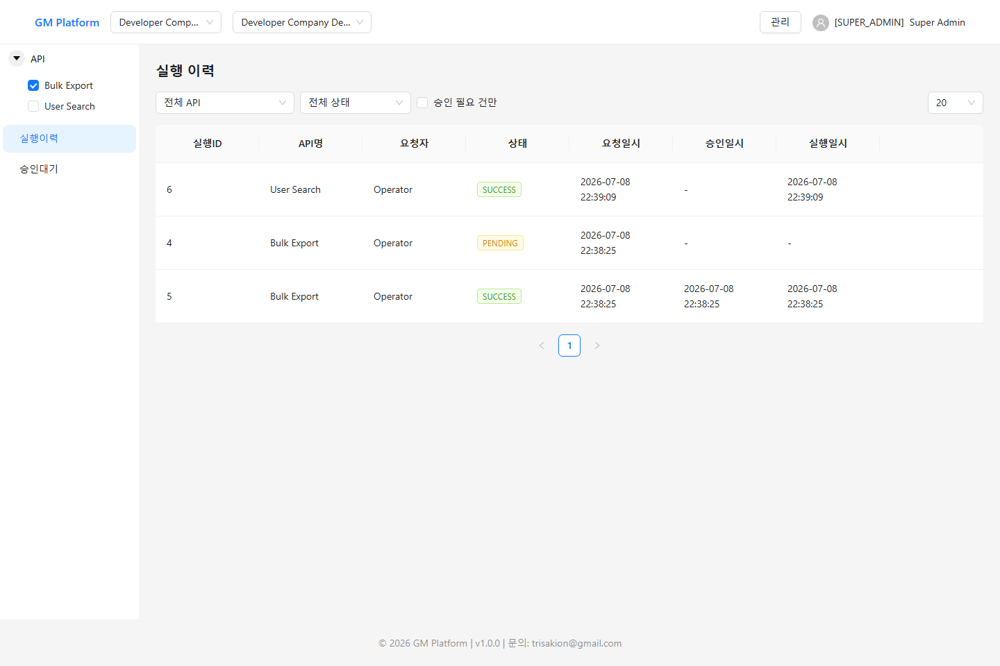
*그림 13. 실행이력 목록*

목록의 "상태" 컬럼은 아래 값 중 하나로 표시됩니다.

| 값 | 의미 |
| --- | --- |
| PENDING (10) | 승인 대기 중 |
| APPROVED (20) | 승인됨 — 게임서버 호출 진행 중 |
| REJECTED (30) | 반려됨 — 게임서버가 호출되지 않음 |
| SUCCESS (40) | 게임서버 호출 성공 |
| FAILED (50) | 게임서버 호출 실패 (에러 메시지 확인 가능) |
| CANCELED (60) | 요청자가 직접 취소함 |

## 6.3 승인 대기 처리 (SUPER_ADMIN·DEVELOPER·APPROVER)

승인이 필요한 실행 요청은 목록에서 바로 승인/반려할 수 없고, **상세 화면에서 요청 파라미터를 확인한 뒤에만** 처리할 수 있습니다 — 내용을 보지 않고 누르는 실수를 막기 위함입니다.

| 승인 대기 목록 (그림 14) | 승인 대기 상세 (그림 15) |
| --- | --- |
| 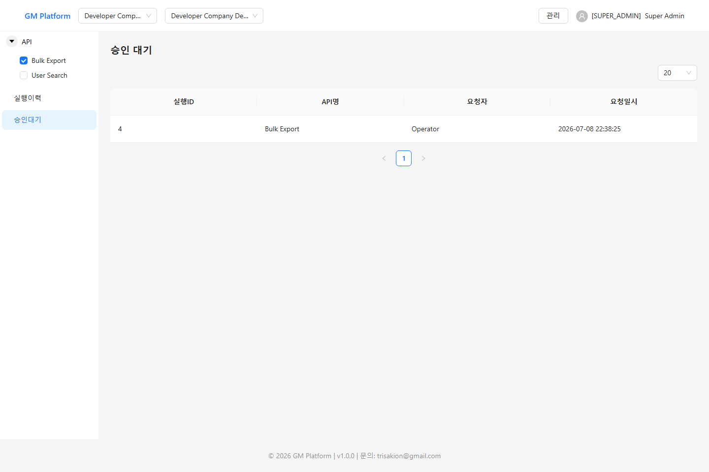 | 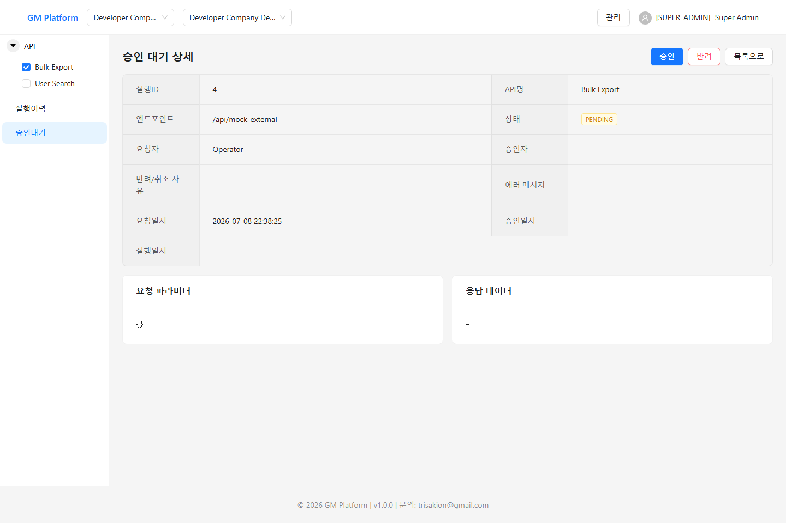 |

승인하면 그 즉시 게임서버가 호출되고 결과가 실행 이력에 반영됩니다. 반려하면 게임서버는 호출되지 않습니다.

---

# 7. 감사 로그 (SUPER_ADMIN·DEVELOPER·APPROVER)

회사/프로젝트/사용자/API 정의/공통코드 등 운영 데이터의 모든 변경 이력이 Append-Only(수정·삭제 없이 계속 쌓이기만 하는 방식)로 기록됩니다. 변경 전/후 값을 함께 확인할 수 있어, "언제 누가 무엇을 바꿨는지" 추적이 필요할 때 사용합니다.

오지급·오제재 같은 운영 사고가 발생했을 때 가장 먼저 확인해야 할 화면이기도 합니다 — 로그 자체가 수정·삭제되지 않으므로, "그 값을 누가 언제 바꿨는지"를 사후에도 그대로 신뢰할 수 있는 근거 자료로 쓸 수 있습니다.

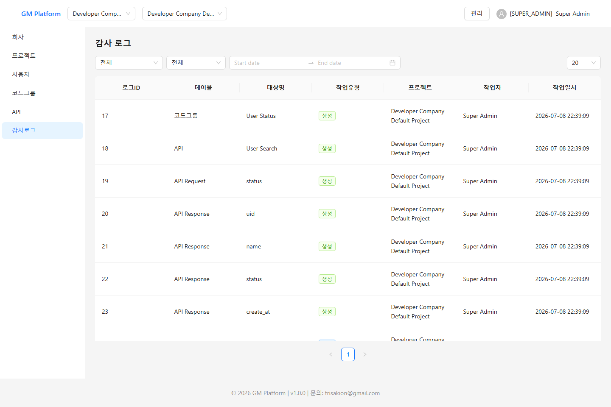
*그림 16. 감사로그 목록*

---

# 8. 게임서버 개발자를 위한 연동 안내

이 장은 GM Platform과 여러분의 게임서버를 실제로 연결하는 **백엔드 개발자**를 위한 내용입니다.

## 8.1 API 계약

GM Platform이 등록된 API를 실행할 때, 여러분의 게임서버는 항상 아래 규칙으로 호출받습니다.

```
POST {API Base URL}{Endpoint}
Content-Type: application/json
X-API-Key: <발급받은 키>   (키를 발급한 경우에만)

Body: 5.4에서 등록한 Request 파라미터가 그대로 JSON으로 전달됨
```

응답은 아래 봉투(envelope) 형식을 지켜주셔야 GM Platform이 정상적으로 성공/실패를 판정하고 화면에 표시합니다.

```json
{
  "result": 0,
  "message": "OK",
  "data": [ { "...": "..." } ]
}
```

- `result`가 `0`이면 성공, 그 외 값이면 실패로 간주하고 `message`를 실행 이력의 에러 메시지로 그대로 노출합니다.
- `data`는 **항상 배열**입니다. 응답 표시 방식이 KEY_VALUE면 `data[0]`을 단일 객체로, GRID면 `data` 전체를 표(행 목록)로 사용합니다.
- HTTP 상태 코드 자체가 4xx/5xx여도 body에 `{ result, message }`가 있으면 그 `message`가 그대로 표시됩니다(예: 인증 실패 시 "인증에 실패했습니다." 같은 메시지). body 없이 순수 네트워크 오류(타임아웃, 연결 거부 등)인 경우에만 일반적인 오류 문구가 표시됩니다.
- 실행 타임아웃 기본값은 10초입니다.

## 8.2 X-API-Key 검증 붙이기

5.5에서 발급받은 키를 여러분의 서버 환경변수(예: `API_KEY`)에 설정하고, 요청 헤더의 `X-API-Key`와 비교하는 미들웨어를 API 앞단에 붙이면 됩니다. 권장 방식:

- 문자열 단순 비교(`===`) 대신 **상수 시간 비교**(Node.js라면 `crypto.timingSafeEqual`)를 사용해 타이밍 공격을 방지합니다.
- 헤더가 없는 경우와 값이 다른 경우를 **동일한 오류**로 응답해, 실패 원인을 굳이 구분해서 알려주지 않습니다.
- 상태 확인용 엔드포인트(health check)처럼 GM Platform이 호출하지 않는 경로는 검증 대상에서 제외해도 됩니다.

Node.js/Express 기준 참고 구현 예시입니다. 다른 언어/프레임워크를 쓰신다면 같은 로직(상수 시간 비교, 동일 오류 응답)만 그대로 옮기시면 됩니다.

> **경고**: 아래 `if (!expectedKey) return next();`는 `API_KEY`를 아직 설정하지 않은 **로컬 개발 환경 전용** 예외 처리입니다. 운영 환경에 이 스킵 로직이 그대로 남아 있으면 `API_KEY`를 설정하지 않는 실수 하나로 인증이 통째로 뚫립니다. 운영 배포 전에는 반드시 `API_KEY`가 설정되어 있는지 확인하거나, 이 분기 자체를 제거하세요.

```js
const { timingSafeEqual } = require('crypto');

function apiKeyAuth(req, res, next) {
  const expectedKey = process.env.API_KEY; // GM Platform에서 발급받아 설정해둔 값
  if (!expectedKey) return next(); // 로컬 개발 전용 스킵 — 운영 환경에서는 반드시 API_KEY를 설정할 것

  const header = req.header('X-API-Key');
  if (!header) {
    return res.status(401).json({ result: 10001, message: '인증에 실패했습니다.', data: [] });
  }

  const expected = Buffer.from(expectedKey);
  const actual = Buffer.from(header);
  if (expected.length !== actual.length || !timingSafeEqual(expected, actual)) {
    return res.status(401).json({ result: 10001, message: '인증에 실패했습니다.', data: [] });
  }

  next();
}

// health check 등 검증이 필요 없는 경로는 이 미들웨어보다 먼저 등록
app.use('/api', apiKeyAuth);
```

## 8.3 API 등록 절차 요약 (체크리스트)

1. 게임서버 개발 완료 후, GM Platform에서 해당 프로젝트의 상세 화면에 **API Base URL**을 설정
2. **API 키를 발급**받아 게임서버 환경변수에 설정하고, 서버에 X-API-Key 검증 미들웨어 적용
3. GM Platform "API 정의" 화면에서 API 등록: 코드/이름/Endpoint/승인필요여부/응답표시방식
4. Request 파라미터, Response 파라미터 등록 (공통코드가 필요하면 먼저 코드그룹부터 등록)
5. "API 실행" 화면에서 직접 실행해보며 정상 동작 확인
6. 운영에 실제로 사용하기 전, 5.4에서 소개한 `api_stage`(개발/승인/운영)를 올바르게 설정 — 이 단계가 이 문서 전체를 통틀어 가장 핵심적인 안전장치 중 하나이므로, 아래 표로 실행 가능 역할을 확인하세요.

| api_stage | 의미 | 실행 가능 역할 |
| --- | --- | --- |
| 20 (개발) | 아직 검증 전인 개발 단계 | SUPER_ADMIN, DEVELOPER |
| 30 (승인) | 검증이 진행 중인 단계 | + APPROVER |
| 40 (운영) | 실서비스에 반영된 단계 | + OPERATOR |

즉 `api_stage`가 20이면 OPERATOR·APPROVER는 이 API를 아예 실행할 수 없고, 40으로 올려야 비로소 모든 역할이 실행할 수 있습니다.

---

# 9. 자주 묻는 질문

**Q. 회원가입 화면에서 회사코드/프로젝트코드를 모르겠어요.**
담당자(SUPER_ADMIN)에게 문의해 코드를 받아야 합니다. 로그인 전 화면이라 목록이 공개되지 않습니다.

**Q. 로그인이 안 됩니다.**
계정 상태(가입승인대기/반려/사용중지)에 따라 각각 다른 안내 메시지가 표시됩니다. 승인대기 상태라면 담당자의 승인을 기다려야 합니다.

**Q. API를 실행했는데 "승인대기"로만 뜨고 결과가 안 나와요.**
그 API가 승인 필요 API(`is_required_approval=1`)이고 요청자가 OPERATOR인 경우입니다. SUPER_ADMIN·DEVELOPER·APPROVER가 "승인 대기" 화면에서 승인해야 실제로 게임서버가 호출됩니다.

**Q. 게임서버 실행 결과가 계속 실패로 떨어져요.**
실행 이력 상세의 에러 메시지를 먼저 확인하세요. "인증에 실패했습니다" 계열 메시지라면 X-API-Key 불일치(8.2 참고)를, 그 외 메시지라면 게임서버 쪽 응답 봉투 형식(8.1 참고)을 확인하는 것이 가장 빠릅니다.

**Q. API Base URL을 바꿨더니 실행이 전부 인증 실패로 뜹니다.**
정상입니다 — 서버 주소를 바꾸면 API 키가 자동으로 폐기됩니다. 프로젝트 상세 화면에서 키를 재발급받아 게임서버에 다시 설정하세요.

---

# 10. 문의

이 문서에서 다루지 않는 내용이나 오류가 발생하면 GM Platform 운영 담당자에게 문의하세요.
