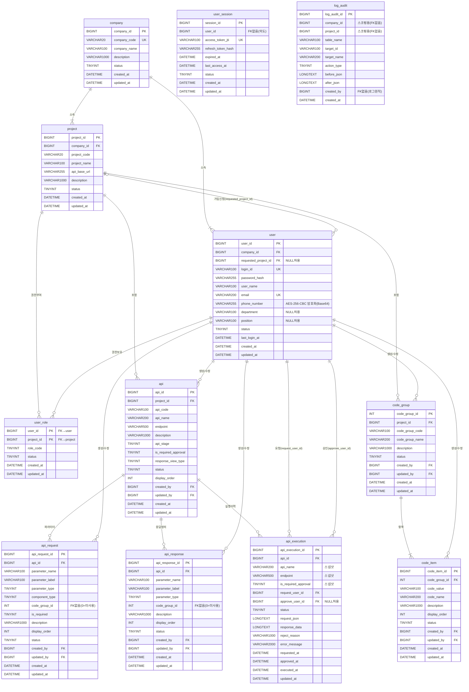

# 02_ERD.md

## GM-Tool Entity Relationship Diagram

---

---

## FK 미적용 항목

| 테이블 | 컬럼 | 이유 |
|--------|------|------|
| `user_session` | `user_id` | MySQL → Redis 저장소 전환 시 인증 로직 수정 없이 확장 가능하도록 설계 |
| `api_request` | `code_group_id` | 0(미사용) 허용, 선택적 참조 |
| `api_response` | `code_group_id` | 0(미사용) 허용, 선택적 참조 |
| `log_audit` | 전체 | Append-Only 로그 테이블 원칙 — FK 없음 |

---

## 스냅샷 컬럼

`api_execution` 테이블의 아래 컬럼은 실행 시점의 값을 복사하여 저장한다.

| 컬럼 | 원본 |
|------|------|
| `api_name` | `api.api_name` |
| `endpoint` | `api.endpoint` |
| `is_required_approval` | `api.is_required_approval` |

`api_base_url` 은 스냅샷 저장하지 않으며 호출 시점의 `project.api_base_url` 을 사용한다.

---

## 상태 코드 요약

| 테이블 | 컬럼 | 값 |
|--------|------|----|
| company, project, api, api_request, api_response, code_group, code_item, user_role, user_session | status | 1:사용 / 0:중지 |
| user | status | 0:가입승인대기 / 1:가입승인 / 2:가입반려 / 3:사용중지 |
| user_session | status | 1:사용 / 0:로그아웃 / 2:만료 |
| api | api_stage | 20:개발 / 30:승인 / 40:운영 |
| api_execution | status | 10:PENDING / 20:APPROVED / 30:REJECTED / 40:SUCCESS / 50:FAILED / 60:CANCELED |
| log_audit | action_type | 10:CREATE / 20:UPDATE / 30:STATUS_CHANGE |
