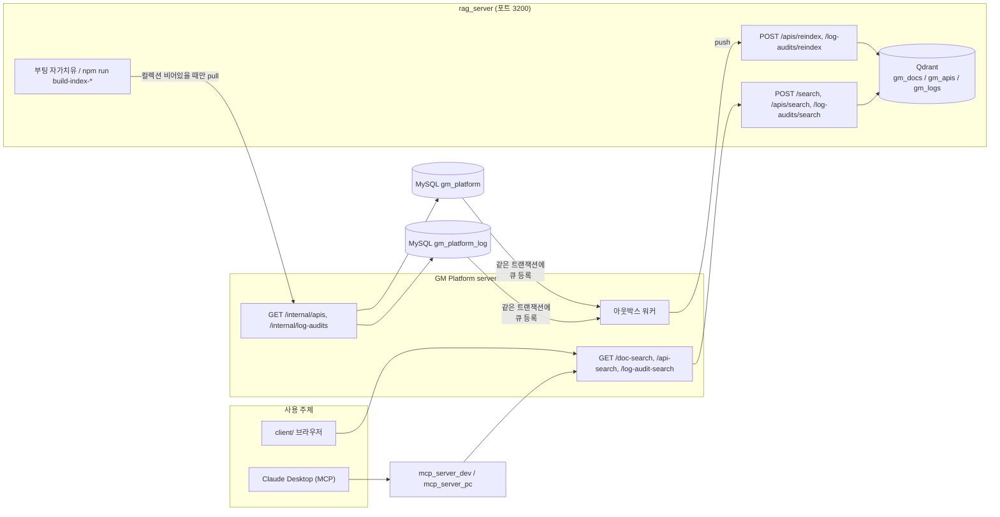
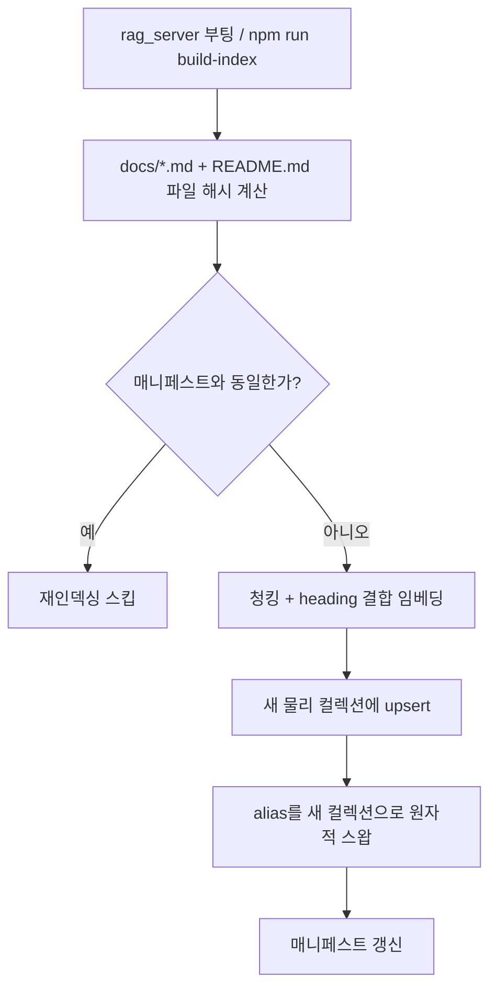
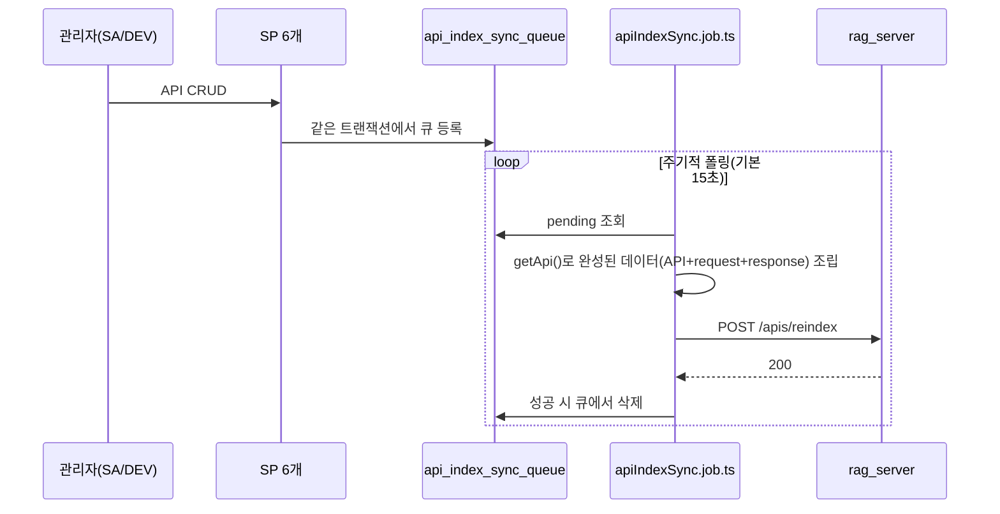
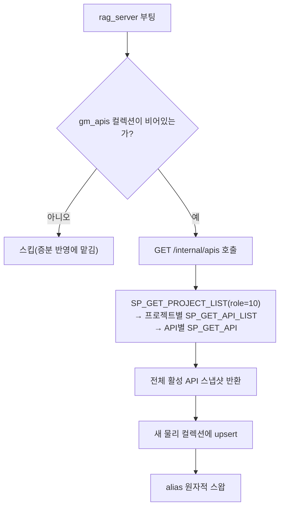
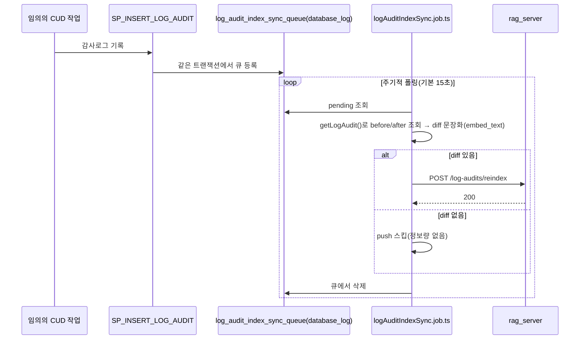
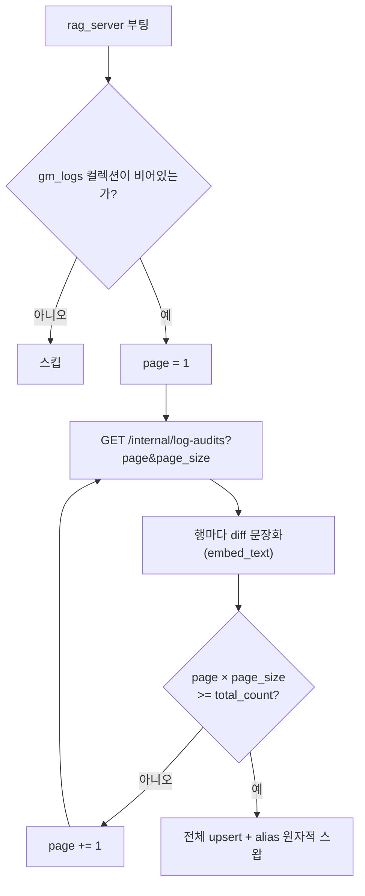

# 21_RAG_SERVER.md

# RAG 서버 (문서/API 정의 검색)

---

# 1. 개요

GM Platform의 설계 문서(`docs/`)·프로젝트 소개(`README.md`, Phase 1, §10.1)와 API 정의(`api`/`api_request`/`api_response`, Phase 2, §10.2)를 자연어로 검색할 수 있게 하는 독립 서비스. gm_platform의 서버·DB 코드에는 손대지 않고 완전히 별도 프로세스로 동작하며, `test_game_server/`와 마찬가지로 상시 구동되는 Express+TypeScript HTTP 서비스다.

| 항목 | 값 |
| ---------- | ------------------------------------- |
| 위치 | `rag_server/` (모노레포 내부) |
| 포트 | `3200` (3000/3100 다음 번호) |
| 벡터 DB | Qdrant(로컬, `http://127.0.0.1:6333`) — 별도 설치 없이 이미 떠있는 인스턴스 사용 |
| 임베딩 | 로컬 모델(`@xenova/transformers`, `Xenova/multilingual-e5-base`, 768차원) — 외부 API 키·비용 없음 |
| 스택 | Express + TypeScript, `server/`/`test_game_server/`와 동일 패턴(config/routes/controllers/services/middleware) |
| 대상(Phase 1) | `docs/` 폴더 하위 모든 `.md` + 저장소 루트 `README.md`. `CLAUDE.md`는 보류(§1-1) |
| 사용 주체 | Claude(MCP, `mcp_server_dev`/`mcp_server_pc`를 통해) + GM Platform 자체(`server/` 프록시 경유) 양쪽 |

RAG 대상 후보로 문서 외에 API 정의(`api`/`api_request`/`api_response`)와 감사로그(`log_audit`)도 있었으나, 이 둘은 프로젝트/회사 단위 접근제어가 이미 걸려 있어 검색 경로에도 같은 스코핑을 이식해야 한다. 접근제어가 필요 없는 문서를 Phase 1로 먼저 구현했다(§10.1). API 정의(Phase 2)와 감사로그(Phase 3) 모두 구현·검증 완료(§10.2, §10.3).

### 전체 구조



rag_server는 GM Platform의 스키마를 모르는 별도 프로세스다(MSA 경계) — `server/`가 완성된 데이터를 push/pull로 넘겨줄 뿐, rag_server가 직접 `gm_platform`/`gm_platform_log` 테이블을 조회하지 않는다(advisory lock 전용 접속은 예외, §3.4). Phase 1(문서)만 예외적으로 아웃박스가 없다 — 정적 파일이라 DB 큐를 거칠 이유가 없다(§10.1).

## 1-1. `CLAUDE.md`는 이번 범위에서 보류

`docs/`와 `README.md`는 공개 문서라 접근제어 걱정이 없지만, `CLAUDE.md`는 외부 비공개 문서(`.gitignore` 대상)라 인덱싱하려면 이 서비스를 반드시 신뢰된 내부망에만 두고 GM Platform 경유 조회(Stage C)도 항상 `authenticate` 뒤에 있어야 하는 등 별도 신뢰 경계 검토가 필요하다. 지금은 대상에서 제외한다.

---

# 2. 폴더 구조

```
rag_server/
├── .env / .env.example        # PORT, EMBEDDING_MODEL, QDRANT_URL, QDRANT_API_KEY, QDRANT_COLLECTION, RAG_API_KEY, DB_HOST/PORT/USER/PASSWORD/NAME
├── package.json                 # express, @xenova/transformers, @qdrant/js-client-rest, log4js, dotenv, mysql2
├── tsconfig.json
├── data/                        # gitignore 대상 (index-manifest.json — 파일별 SHA-256 해시)
├── logs/                        # gitignore 대상 (app.log/error.log, log4js dateFile)
└── src/
    ├── app.ts                   # 엔트리포인트 — listen() 즉시 호출, 백그라운드로 임베더 warmUp() → 매니페스트 비교 → 필요시 reindex.ts 재사용(실패 시 지수 백오프 재시도, §3.5), 완료 시 readiness.markReady()
    ├── readiness.ts             # app.ts 부팅(모델 로딩+필요시 재인덱싱) 완료 여부 — embedder.ts의 isReady()(모델 로딩만 반영)와 별개로 둔 검색 게이팅용 전역 상태(순환참조 회피)
    ├── config/
    │   ├── env.ts                # dotenv 로드 및 검증
    │   ├── logger.ts             # log4js 설정 (gm_platform과 동일 패턴)
    │   ├── qdrant.ts             # QdrantClient 싱글톤
    │   └── db.ts                 # GM Platform 본체와 동일 MySQL — runExclusive()(advisory lock, server/의 동일 패턴 재사용). rag_server 전용 테이블 없음
    ├── embedding/
    │   ├── embedder.ts           # @xenova/transformers pipeline('feature-extraction', model) 래퍼 + isReady()/warmUp() 논블로킹 로딩
    │   └── chunker.ts            # docs/*.md + README.md 헤딩 분할
    ├── index/
    │   ├── store.ts              # Qdrant 컬렉션 생성/upsert/검색 래퍼(gm_docs/gm_apis 공용 저수준 함수 + 각 컬렉션 전용 얇은 wrapper) + alias 원자적 스왑
    │   ├── manifest.ts           # data/index-manifest.json 읽기/쓰기 — 파일별 SHA-256 해시로 변경 여부 판단(gm_docs 전용, gm_apis는 매니페스트 없이 §10.2의 자가치유만 사용)
    │   ├── reindex.ts            # gm_docs — 청킹→임베딩→Qdrant 재구축 흐름 + config/db.ts의 runExclusive로 감싼 forceReindex()/reindexIfChanged() — build.ts와 app.ts 부팅 시 각각 재사용
    │   ├── build.ts               # `npm run build-index` 진입점 — forceReindex()를 호출하는 CLI 래퍼
    │   ├── apiReindex.ts         # gm_apis(Phase 2, §10.2) — upsertOneApi(push 수신 증분)/rebuild(pull 기반 전체 재구축)/apiReindexIfChanged(부팅 자가치유)/forceReindexApis
    │   └── buildApis.ts          # `npm run build-index-apis` 진입점 — forceReindexApis()를 호출하는 CLI 래퍼
    ├── routes/
    │   ├── docSearch.ts          # POST /search
    │   ├── apiSearch.ts          # POST /apis/search, POST /apis/reindex (§10.2)
    │   └── health.ts             # GET /health
    ├── controllers/
    │   ├── docSearch.controller.ts
    │   └── apiSearch.controller.ts
    ├── services/
    │   ├── docSearch.service.ts
    │   └── apiSearch.service.ts  # project_roles → Qdrant should 필터 변환(§10.2 "스코핑")
    ├── middleware/
    │   ├── apiKeyAuth.ts         # test_game_server와 동일 패턴 — X-API-Key 상수시간 비교
    │   ├── errorHandler.ts
    │   └── requestLogger.ts
    ├── constants/
    │   └── errors.ts
    ├── types/
    │   └── index.ts
    └── utils/
        ├── logger.ts
        └── response.ts           # success/fail — { result, message, data } 봉투 (gm_platform과 동일 관례)
```

`.gitignore`는 별도로 두지 않는다 — 루트 `.gitignore`의 `node_modules/`, `dist/`, `.env`, `logs/` 패턴이 슬래시 없이 정의돼 있어 `rag_server/`에도 그대로 적용된다.

---

# 3. 동작 방식

## 3.1 임베딩

로컬 모델(`@xenova/transformers`, `Xenova/multilingual-e5-base`, 768차원)로 Node 프로세스 안에서 직접 임베딩을 생성한다 — 외부 API 키·과금 없이 완전 오프라인으로 동작(최초 실행 시 모델 파일만 1회 다운로드, ~283MB). 원래는 경량 다국어 모델(`Xenova/paraphrase-multilingual-MiniLM-L12-v2`, 384차원)을 썼으나, "기술 스택"/"테크스택"처럼 짧고 일반적인 질의에서 실제로 무관한 청크가 상위권을 차지하는 anisotropy(hubness) 현상이 실측으로 확인돼 검색(retrieval) 목적으로 학습된 이 모델로 교체했다. 재검증 결과 실패하던 두 질의가 각각 1~2위로 올라섰고, 기존에 잘 되던 질의도 회귀 없이 스코어가 더 견고해졌다(0.2~0.7의 넓은 분포 → 0.77~0.88의 좁은 분포).

`multilingual-e5` 계열은 문서(passage)와 질의(query)를 비대칭으로 인코딩하도록 학습돼 있어, 임베딩 직전에 반드시 프리픽스를 붙여야 한다 — 청크 쪽은 `reindex.ts`가 `"passage: "`, 질의 쪽은 `docSearch.service.ts`가 `"query: "`를 붙인다. 다른 계열 모델로 바꾸면 이 프리픽스 로직도 함께 재검토해야 한다. 모델을 바꿀 때는 `store.ts`의 `VECTOR_SIZE`도 실제 출력 차원과 맞춰야 하며(다르면 Qdrant `createCollection` 자체가 실패), 차원이 바뀌었어도 `rebuildAndSwap()`이 매번 새 물리 컬렉션을 만드는 구조라 기존 컬렉션을 수동으로 지울 필요는 없다 — `npm run build-index` 한 번이면 충분하다.

청크 임베딩에는 본문(`text`)뿐 아니라 heading(breadcrumb, `heading + "\n" + text`)도 함께 포함한다 — 표·의사코드 위주라 본문에 실제 검색 키워드가 거의 없는 청크도(예: "9. 비밀번호 변경 > ... > 처리 정책") 정확히 검색되게 하기 위함. Qdrant payload의 `heading`/`text` 필드는 이와 무관하게 원본 그대로다.

본문이 마크다운 표로만 이루어진 청크는 임베딩 직전에 표를 파이프·구분행 없는 평문(`embedding/chunker.ts`의 `flattenTablesForEmbedding`)으로 바꿔서 넣는다 — 파이프투성이 원문 그대로는 자연어 문장 위주로 학습된 모델이 의미를 잘 못 잡기 때문. Qdrant에 저장·응답으로 노출되는 `text`는 원본 마크다운 그대로다(표시용/임베딩용 분리).

## 3.2 청킹 (`embedding/chunker.ts`)

문서를 `#`~`####`(레벨 1~4) 헤딩 단위로 분할하고, 상위 헤딩까지 `" > "`로 이어붙인 breadcrumb을 `heading` 필드에 담는다(예: "6. 보안 정책 > 6.4 세션 정리 정책 > 6.4.1 인스턴스 간 중복 실행 방지"). 본문이 30자 미만인 섹션(제목만 있는 헤딩 등)은 독립 청크로 만들지 않고 다음 섹션에 흡수시킨다.

섹션 본문은 길이와 무관하게 항상 문단(빈 줄) 단위로 소주제별 청크로 나눈다(30자 미만인 조각만 인접 조각과 합침) — 표+설명 문단처럼 서로 무관한 소주제가 한 헤딩 아래 섞여 있으면 mean pooling으로 특정 소주제 질의 신호가 희석되는 문제가 있었기 때문. 빈 줄 없이 문단 하나가 그 자체로 1200자를 넘으면(긴 마크다운 표 등) 줄 단위로 한 번 더 재분할한다.

## 3.3 인덱스 저장 (Qdrant)

`gm_docs`는 실제 컬렉션이 아니라 **alias**다. 재구축(`store.ts`의 `rebuildAndSwap()`)마다 새 물리 컬렉션(`gm_docs_<timestamp>`)에 전체 청크를 전량 upsert한 뒤, `updateCollectionAliases()`로 alias를 그 컬렉션으로 원자적으로 재지정하고 나서야 이전 물리 컬렉션을 삭제한다 — 검색은 항상 "완전한 옛 인덱스" 아니면 "완전한 새 인덱스"만 보고, 재구축 도중의 빈 컬렉션이나 컬렉션 없음 오류를 절대 관측하지 않는다.

`config/qdrant.ts`의 `QdrantClient`는 `timeout: env.qdrant.timeoutMs`(기본 60000ms)를 명시한다 — 라이브러리 기본값(300초)을 그대로 두면 Qdrant가 응답 없이 멈춘 상태에서 검색 요청 하나가 최대 5분까지 물릴 수 있었다. 이 타임아웃은 클라이언트가 만드는 모든 호출(검색·재인덱싱의 대량 upsert 포함)에 동일하게 적용되는 전역값이라(`upsert()`는 호출별 override를 지원하지 않음), 너무 짧게 잡으면 정상 재인덱싱까지 끊어버린다 — `reindex.ts`의 `LOCK_TIMEOUT_MS`(60000, "실측 재구축 시간보다 넉넉하게")와 동일한 여유 기준으로 맞췄다.

## 3.4 재인덱싱 트리거

- **부팅 시 자동** — 매니페스트 비교보다 먼저 `store.ts`의 `isIndexHealthy()`로 Qdrant의 실제 인덱스 상태(alias가 존재하고 `points_count > 0`인지)를 확인한다. 비어있으면(alias/컬렉션을 콘솔 등으로 직접 삭제한 경우 등) 매니페스트 일치 여부와 무관하게 즉시 강제 재구축한다(자가 치유) — 매니페스트는 어디까지나 로컬 파일이라 Qdrant 쪽 상태 변화를 전혀 알 수 없기 때문에, 문서 내용이 그대로면 재인덱싱을 스킵하고도 `markReady()`가 호출돼 실제로는 존재하지 않는 alias를 검색이 조회하려다 실패하는 결함이 있었다. 인덱스가 정상이면 그 다음 `data/index-manifest.json`(파일별 SHA-256 해시 + `EMBEDDING_MODEL`명·차원)과 현재 `docs/*.md`+`README.md`, 현재 설정값을 비교해 변경이 있을 때만 재구축한다. 모델명·차원도 매니페스트에 포함시킨 이유: 문서 내용은 그대로여도 `EMBEDDING_MODEL`을 바꾸면 기존 Qdrant 컬렉션의 벡터가 새 모델과 차원이 달라 호환되지 않는데, 문서 해시만 비교하면 이를 "변경 없음"으로 오판해 옛 컬렉션을 그대로 alias에 남겨두게 된다(다음 검색 요청이 벡터 크기 불일치로 실패).
- **수동** — `npm run build-index`. 서버가 이미 떠있는 상태에서 실행해도 무방하다. 매니페스트 비교 없이 항상 무조건 재구축이라 `isIndexHealthy()` 확인 대상이 아니다.

두 경로 모두 `config/db.ts`의 `runExclusive()`(MySQL advisory lock, `SP_LOCK_ACQUIRE`/`SP_LOCK_RELEASE` 재사용)로 감싸져 있어 여러 재구축이 동시에 겹치지 않는다. 락 획득 후 매니페스트를 한 번 더 비교하므로, 대기 중 다른 프로세스가 이미 최신으로 재구축을 끝냈다면 중복 작업 없이 넘어간다.

## 3.5 준비 상태(readiness)

`app.ts`는 `listen()`을 즉시 호출해 서버 자체는 곧장 기동하고, 백그라운드로 모델 로딩(`embedder.ts`의 `warmUp()`) → 필요시 재인덱싱까지 마쳐야 `readiness.ts`의 `isReady()`가 `true`가 된다. 준비 전 `POST /search`는 붙잡아두지 않고 즉시 503(`MODEL_LOADING`)을 반환하며, `GET /health`도 같은 상태를 `loading`/`ok`로 노출한다.

`warmUp()`+`reindexIfChanged()`가 실패하면(예: MySQL/Qdrant가 이 서버보다 늦게 뜨는 배포 순서) `app.ts`의 `bootstrapWithRetry()`가 지수 백오프(1s→2s→4s→...,최대 10s 간격)로 재시도한다. `RAG_BOOT_RETRY_MAX_MS`(기본 60초) 누적 시간 안에 성공 못 하면 포기하고 리턴한다 — 이때 프로세스는 종료하지 않으며(`server/`의 부팅 재시도와 달리 `process.exit()`을 호출하지 않음), `markReady()`가 끝내 호출되지 않아 재시작 전까지 `GET /health`가 `loading`으로 남는다. `warmUp()`은 이미 성공한 뒤에는 캐시된 결과를 즉시 반환하므로(`embedder.ts`), 반복 호출은 `reindexIfChanged()` 쪽 재시도 비용만 든다. 이미 `markReady()`된 이후(런타임 중) 발생하는 Qdrant 장애는 이 재시도 대상이 아니다 — `store.ts`의 `withSocketRetry()`·Qdrant 클라이언트 타임아웃(§3.3)으로 개별 요청 단위에서 이미 격리된다.

## 3.6 인증

선택적 공유키(`RAG_API_KEY`, `X-API-Key` 헤더, `crypto.timingSafeEqual` 상수시간 비교) — `test_game_server/middleware/apiKeyAuth.ts`와 동일 패턴. 미설정 시 검증을 건너뛴다(로컬 개발용). GM Platform `server/`(이미 JWT로 인증된 경로)와 달리 MCP 클라이언트는 JWT 인증 없이 직접 호출하므로, MCP 경로 입장에서는 이 키가 사실상 유일한 방어선이다 — 실사용 전 반드시 실제 값으로 설정한다.

---

# 4. API

응답은 `{ result, message, data: [...] }` 봉투(`server/`/`test_game_server/`와 동일 관례).

## `POST /search`

요청: `{ query: string, top_k?: number }` (`top_k` 기본값 5, 1~20 범위 밖이면 30003)

응답 `data`: `[{ file: string, heading: string, text: string, score: number }]` — `score`는 코사인 유사도(Qdrant가 반환하는 값 그대로).

서버가 아직 준비되지 않았으면(§3.5) 즉시 503(`result: 50002`, "모델을 로드하는 중입니다. 잠시 후 다시 시도하세요")으로 응답한다. `X-API-Key`가 설정된 상태에서 헤더가 없거나 틀리면 401(`result: 10001`).

## `GET /health`

`{ result: 0, data: [{ status: "ok" | "loading" }] }` — `loading`은 §3.5의 준비 상태가 아직 안 끝난 경우.

## `GET /doc-search` (GM Platform `server/` 경유, §7 Stage C)

rag_server가 아니라 GM Platform `server/`가 노출하는 별도 엔드포인트다 — `authenticate`(JWT)만 요구하며 역할 제한은 없다. 내부적으로 위 `POST /search`를 그대로 호출하는 얇은 프록시.

요청: `?q=<string>&top_k=<1~20, 선택>` — 응답 형식은 `{ result: 0, data: [...] }`(GM Platform 공통 관례), `data`의 각 원소 구조는 `POST /search`와 동일.

---

# 5. 인덱스 빌드 (`npm run build-index`)

`src/index/build.ts`가 진입점이다.

1. 저장소 루트 기준 `docs/` 폴더 하위의 모든 `.md` 파일과 저장소 루트의 `README.md`를 읽는다 — `__dirname` 기준 절대경로로 접근한다(`process.cwd()` 상대경로 금지, cwd가 달라지는 실행 환경에서도 안전하도록).
2. `embedding/chunker.ts`로 파일별 청크를 만든다(§3.2).
3. `embedding/embedder.ts`로 각 청크를 768차원 벡터로 변환한다(§3.1).
4. `index/store.ts`의 `rebuildAndSwap()`으로 새 물리 컬렉션을 만들어 전체 청크를 순번 정수 ID로 upsert하고, `gm_docs` alias를 원자적으로 스왑한다(§3.3).

전체 과정은 `forceReindex()`를 통해 MySQL advisory lock으로 감싸져 있어(§3.4), `app.ts`가 이미 떠서 자체 재인덱싱 중이어도 서로 겹치지 않고 순서대로 실행된다.

실행 후 Qdrant REST(`GET /collections/gm_docs`)로 포인트 개수를 확인해 인덱싱이 실제로 반영됐는지 검증할 수 있다(alias로 요청해도 실제 컬렉션과 동일하게 응답한다).

---

# 6. Qdrant 연동

- 접속: `QDRANT_URL`(기본 `http://127.0.0.1:6333`), `QDRANT_API_KEY`(필수 — 이 환경의 Qdrant는 API 키 인증이 걸려 있다) 헤더로 인증.
- `QDRANT_COLLECTION`(기본 `gm_docs`)은 물리 컬렉션이 아니라 **alias**다. 실제 데이터는 `gm_docs_<timestamp>` 형식의 물리 컬렉션에 있고, alias가 그중 "현재 유효한" 컬렉션 하나를 가리킨다(§3.3). 벡터 크기 768, distance `Cosine`은 물리 컬렉션 생성 시 동일하게 적용.
- `@qdrant/js-client-rest`의 `QdrantClient`를 `config/qdrant.ts`에서 싱글톤으로 생성해 `index/store.ts`(인덱싱·alias 스왑)와 `services/docSearch.service.ts`(검색 질의, alias로 조회) 양쪽이 공유한다.
- 이 Qdrant 인스턴스는 rag_server 전용이 아니라 이미 다른 용도로도 떠있는 공용 인스턴스다 — `gm_docs` alias 및 그 물리 컬렉션(`gm_docs_*`)이라는 명확한 이름만 사용해 다른 컬렉션과 섞이지 않게 한다.

---

# 7. MCP / GM Platform 연동

## Stage B — MCP 통합 (완료)

`mcp_server_dev`/`mcp_server_pc` 양쪽에 동일한 구성으로 추가했다(두 프로젝트가 스캐폴딩을 100% 동일하게 복제해 유지하는 기존 관례 그대로).

| 파일 | 역할 |
| --- | --- |
| `src/ragClient.ts` | `gmClient.ts`와 별개의 경량 axios 클라이언트. GM Platform 로그인 상태와 무관하게 `RAG_BASE_URL`로 rag_server를 직접 호출하고, `RAG_API_KEY` 설정 시 `X-API-Key` 헤더를 붙인다. `RagApiError`(rag_server의 result/message를 그대로 담음)를 던진다 |
| `src/tools/searchDocs.ts` | `search_docs` tool. 기존 `safeTool`/`ok()`/`toToolError()` 패턴을 그대로 재사용, `RagApiError` 분기 추가 |
| `index.ts` | 문서 검색은 역할과 무관하게 유용해 role 게이팅 없이 등록 |

**`RAG_ENABLED`(true/false, 기본 `false`)** — `server/`의 `REDIS_ENABLED` 폴백 패턴과 동일하게, `false`면 `RAG_BASE_URL` 검증을 건너뛰고 `search_docs` tool 등록 자체를 생략한다(rag_server를 쓰지 않는 환경에서도 나머지 tool은 정상 기동). `true`인데 `RAG_BASE_URL`이 없으면 즉시 기동 실패한다.

Claude Code CLI뿐 아니라 Claude 데스크탑 앱의 MCP 커넥터로도 동일하게 동작한다(표준 MCP stdio 서버) — 데스크탑 앱 등록과 `search_docs` 실시간 호출까지 end-to-end로 검증 완료.

## Stage C — GM Platform `server/` 프록시 (완료)

`server/`에 `GET /api/doc-search?q=...`(`authenticate`만 요구, 역할 제한 없음)를 신설해 이 서버의 `/search`를 대신 호출한다(§4). GM Platform 자체(향후 `client/` 검색 UI 포함)가 이 프록시를 통해 재사용한다.

`RAG_ENABLED`(true/false, 기본 `false`) — Stage B와 동일한 이름·의미의 토글을 `server/`에도 두었다. `false`면 `/doc-search` 라우트 자체를 등록하지 않는다(`routes/index.ts`, `SWAGGER_ENABLED` 조건부 로드와 동일 패턴) — rag_server 없이도 GM Platform 본체는 정상 기동한다. rag_server 연동 실패(네트워크 오류·타임아웃·모델 로딩 중·rag_server 자체 오류)는 사유를 구분하지 않고 전부 503(`result: 50002`)으로 통일한다.

---

# 8. 환경변수 (`rag_server/.env`)

| 변수 | 설명 | 기본값 |
|------|------|--------|
| `PORT` | 서버 포트 | `3200` |
| `HOST` | 바인딩할 인터페이스 — 신뢰된 내부망 전용 설계 전제(§3)를 강제하기 위해 기본값을 루프백으로 고정. 분리 배포 등으로 원격 호출자를 허용해야 하면 값을 바꾸되, `RAG_API_KEY`만으로는 네트워크 노출 자체를 막지 못하므로 IP 화이트리스트 등 별도 방어를 함께 검토해야 한다 | `127.0.0.1` |
| `EMBEDDING_MODEL` | `@xenova/transformers` 모델 이름(§3.1) — `multilingual-e5` 계열 외 모델로 바꾸면 `query:`/`passage:` 프리픽스 로직과 `store.ts`의 `VECTOR_SIZE`도 함께 재검토 필요 | `Xenova/multilingual-e5-base` |
| `QDRANT_URL` | Qdrant 접속 주소 | `http://127.0.0.1:6333` |
| `QDRANT_API_KEY` | Qdrant API 키 | — |
| `QDRANT_COLLECTION` | 사용할 컬렉션명(alias) | `gm_docs` |
| `QDRANT_TIMEOUT_MS` | Qdrant 클라이언트 응답 대기 타임아웃(ms, §3.3) — 검색·재인덱싱 upsert 모두에 적용되는 전역값이라 `reindex.ts`의 `LOCK_TIMEOUT_MS`와 맞춰뒀다 | `60000` |
| `RAG_BOOT_RETRY_MAX_MS` | 부팅 시 모델 로딩+재인덱싱(`warmUp`/`reindexIfChanged`) 재시도 최대 누적 시간(ms, §3.5) | `60000` |
| `RAG_API_KEY` | `X-API-Key` 헤더 검증값. 미설정 시 검증 스킵(로컬 개발용) — 실사용 전 반드시 설정 | — |
| `DB_HOST`/`DB_PORT`/`DB_USER`/`DB_PASSWORD`/`DB_NAME` | GM Platform 본체(`server/`)와 동일한 MySQL 접속 정보 — 재인덱싱 상호배제용 advisory lock(`SP_LOCK_ACQUIRE`/`SP_LOCK_RELEASE`)만 재사용, rag_server 전용 테이블 없음 | — (전부 필수) |

---

# 9. 실행 방법

```powershell
cd rag_server
npm install
npm run build-index   # docs/ 전체 + README.md 인덱싱 (Qdrant gm_docs 컬렉션 생성)
npm run dev            # tsx watch, 기본 포트 3200
```

Qdrant가 로컬에서 먼저 떠있어야 한다(`http://127.0.0.1:6333`). 재인덱싱 동시 실행 방지에 GM Platform 본체가 쓰는 MySQL advisory lock을 재사용하므로(§3.4), `server/`와 동일한 MySQL 인스턴스 접속 정보(`DB_*`, §8)도 필요하다 — SP만 호출할 뿐 rag_server 전용 테이블·스키마는 없다.

---

# 10. 개발 계획 (진행 상황)

RAG 대상 세 가지(§1 — 문서/API 정의/감사로그)별로 진행 상황을 나눠 정리한다.

## 10.1 문서 검색 (`docs/*.md` + `README.md`) — Phase 1 (완료)

컬렉션 `gm_docs`. GM Platform 설계 문서·`README.md`를 헤딩 단위 청크로 나눠 자연어로 검색한다.

### 제한 (스코핑)

- 인증(`authenticate`)만 요구, 역할 제한 없음 — 원본 문서 자체가 전 역할 공개 정보라 접근제어 대상이 아니다.
- `top_k` 1~20(기본 5). `CLAUDE.md`는 비공개 문서(`.gitignore` 대상)라 신뢰 경계 검토 전까지 색인 대상에서 제외(§1-1).

### 데이터 흐름

**증분 없음 — 사람이 직접 파일을 수정**: `docs/*.md`/`README.md`는 DB 행이 아니라 정적 파일이라, API/감사로그처럼 CRUD를 트리거로 삼는 아웃박스 push 경로 자체가 성립하지 않는다(아래 "아웃박스 동기화" 참고).

**백필/자가치유(pull, 전체 재구축)**: 파일이 바뀌었는지는 별도 이벤트로 알 수 없으므로, 부팅 시(및 `npm run build-index` 수동 실행 시)마다 파일 해시를 비교해 변경 여부를 확인한다.



비교 대상은 파일 해시(+임베딩 모델명)를 담은 매니페스트(`data/index-manifest.json`)다. 임베딩 텍스트는 `heading + "\n" + text`(청크 정체성 확보용 — 표·의사코드 위주라 본문만으로는 검색 키워드가 부족한 청크 대응), 마크다운 표는 파이프 없는 평문으로 변환해 임베딩하되 표시용 `text`는 원본 마크다운을 그대로 유지한다(§3.1). 문단(빈 줄) 경계로 청크를 나누는 로직은 펜스드 코드블록(` ``` `) 안팎을 구분해, 내부에 빈 줄이 있는 코드블록이 여닫는 펜스 없이 여러 청크로 쪼개지는 문제를 방지한다(`chunker.ts`의 `splitIntoParagraphs()`).

### 컬렉션 구조

단일 컬렉션. 접근제어 자체가 없어 Phase 2/3처럼 payload 기반 필터를 둘 이유가 없다. alias(`gm_docs`) → 물리 컬렉션(`gm_docs_<timestamp>`) 원자적 스왑 구조(§3.3)라 재인덱싱 중에도 검색은 항상 완전한 인덱스만 본다. payload는 `file`/`heading`/`text`(전부 표시용).

### 아웃박스 동기화

해당 없음 — 문서는 사람이 직접 수정하는 정적 파일이라 건별 증분 반영이 필요한 쓰기 경로 자체가 없다. 위 "데이터 흐름"의 파일 해시 비교 기반 전체 재구축이 유일한 갱신 경로다.

### API

| 엔드포인트 | 설명 |
|---|---|
| `POST /search`(rag_server) | `{query, top_k?}` → `[{file, heading, text, score}]`. `apiKeyAuth`. |
| `GET /doc-search`(server/) | `authenticate`만 요구. `RAG_ENABLED=false`면 라우트 자체 미등록. |

구현 범위: rag_server 코어 → MCP tool(`search_docs`) → `server/` 프록시(`GET /doc-search`) → `client/` 검색 UI(`/doc-search`, 전 역할 메인 메뉴).

## 10.2 API 정의 (`api`/`api_request`/`api_response`) — Phase 2 (완료)

컬렉션 `gm_apis`. 프로젝트별 API 정의(요청/응답 파라미터 포함)를 자연어로 검색한다. Phase 1과 근본적으로 다른 지점 둘: (1) API 정의는 DB 행이라 정적 파일 해시 비교가 안 통해 push 기반으로 전환, (2) `project_id`+`api_stage` 두 축의 접근제어가 걸려 있어 검색 결과에도 이 스코핑을 재현해야 한다.

### 제한 (스코핑)

- `GET /api-search?q=...&project_id=...` — `authenticate`만 요구(전 역할, `GET /apis`와 동일 범위)하되 `project_id`는 헤더에서 선택된 프로젝트로 **강제 스코핑**되는 필수 파라미터다(다른 프로젝트 종속 화면과 동일 원칙 — SUPER_ADMIN도 예외 없음, 누락 시 30001).
- 그 프로젝트 안에서 호출자의 실제 `role_code`로 다시 필터링 — `role_code <= api_stage`인 API만 노출된다(`api_stage=20`은 SA/DEV, `30`은 +APV, `40`은 전체 역할 — `Sidebar.tsx`의 `canExecuteStage()`/`SP_CREATE_API_EXECUTION`과 동일 규칙). 실행할 수 없는 API가 검색엔 걸리는 불일치를 막기 위함.
- 호출자가 그 `project_id`에 실제 배정이 없으면 에러 대신 빈 결과(강제 스코핑이 인가 우회를 뜻하지 않음).

### 데이터 흐름

**증분(push, 생성/수정 시)**:



**백필/자가치유(pull, 전체 재구축)**:



새 SP 없이 기존 조회 SP를 SUPER_ADMIN 컨텍스트로 조합해 재사용한다. `bootstrapWithRetry()`(§3.5)에 편입, `npm run build-index-apis`도 동일 경로.

### 컬렉션 구조

단일 컬렉션 `gm_apis` + payload 필터(`project_id`/`api_stage`/`status`) — 스테이지·역할별로 쪼개지 않는다. `role_code <= api_stage`가 Qdrant `range` 필터로 그대로 표현되고, 같은 사용자가 프로젝트마다 역할이 달라 컬렉션을 나눠도 프로젝트별 조건은 어차피 남기 때문. 스코핑은 프로젝트별 `{project_id 일치} AND {api_stage >= role_code}` 조건을 Qdrant `should`(OR)로 묶어 재현하며, `project_roles: null`(SUPER_ADMIN)이면 `status=1` 필터만 적용한다. `project_roles` 필드 자체가 없으면 무제한으로 해석하지 않고 400(fail-closed).

### 아웃박스 동기화

`api_index_sync_queue`(메인 DB, `api_id` UNIQUE) — API 쓰기 SP 6개가 도메인 변경과 **같은 트랜잭션**에 큐를 등록(`ON DUPLICATE KEY UPDATE` dedup)해, "API는 바뀌었는데 큐 등록은 실패" 창을 없앤다. `server/`의 재귀 `setTimeout` 폴링 워커(기본 15초, `runExclusive` advisory lock으로 인스턴스 간 중복 방지)가 주기적으로 비우고, 실패 시 무기한 재시도(dead-letter 없음). 삭제에는 `updated_at` 일치를 확인하는 낙관적 동시성 가드를 둬, 워커가 push하는 사이 같은 API가 다시 수정돼 재큐잉되면 최신 변경분을 지우지 않도록 방어한다.

### API

| 엔드포인트 | 설명 |
|---|---|
| `POST /apis/search`(rag_server) | `{query, top_k?, project_roles: {project_id, role_code}[] \| null}` → `[{api_id, project_id, project_name, api_name, api_code, endpoint, score}]`. `project_roles` 누락/형식 오류 시 400. `apiKeyAuth`. |
| `POST /apis/reindex`(rag_server) | 아웃박스 워커 전용 push 수신. `apiKeyAuth`. |
| `GET /api-search`(server/) | `q`/`project_id` 필수. |
| `GET /internal/apis`(server/) | rag_server 전용 pull 경로, `ragKeyAuth`. |

`npm run build-index-apis`(rag_server CLI) — 전체 재구축 수동 실행. 환경변수: `QDRANT_APIS_COLLECTION`(rag_server, 기본 `gm_apis`), `API_INDEX_SYNC_INTERVAL_MS`(server, 기본 `15000`).

구현 범위: rag_server 코어 → 아웃박스 동기화 → `server/` 프록시(`GET /api-search`) → `client/` 검색 UI(`/api-search`, `project_id` 없으면 검색창 자체를 숨기고 "프로젝트를 선택하세요" 표시) → MCP tool(`search_apis`, GM Platform을 경유해 rag_server를 직접 호출하지 않음).

## 10.3 감사로그 (`log_audit`) — Phase 3 (완료)

컬렉션 `gm_logs`. 감사 로그의 변경 diff를 자연어 문장으로 만들어 검색한다. `log_audit`이 이미 물리적으로 분리된 별도 DB(`gm_platform_log`, `database_log/`)에 있어 Phase 2와 근본적으로 다른 지점이 있다(아래 "아웃박스 동기화" 참고).

### 제한 (스코핑)

- `GET /log-audit-search`는 `GET /log-audits`와 동일하게 SUPER_ADMIN/DEVELOPER/APPROVER 전용(원본 리소스 자체가 이미 3개 역할로 제한).
- 검색 대상은 호출자가 role_code≤30으로 실제 배정된 프로젝트 로그(멤버십 매치) + 본인 소속 회사 로그(project_id 없는 로그, 예: company/user 테이블 변경)로 스코핑 — `logAudit.service.ts`의 기존 규칙 재사용.
- 헤더에서 선택된 `project_id`/`company_id`(둘 다 선택)로 검색 범위를 추가로 좁힐 수 있으나, 위 권한 스코프를 넓히지는 못한다 — rag_server가 항상 권한 필터와 AND로 결합(`project_id`가 있으면 `company_id`는 무시).
- diff가 없는(정보량 없는) 로그는 애초에 색인하지 않는다 — 예: 비밀번호 변경은 `password_hash`가 감사로그 스냅샷 자체에 포함되지 않아 diff가 항상 빈다. 짧고 정형화된(템플릿 같은) diff가 대량 축적되면 임베딩 공간의 "허브"가 되어 무관한 질의에도 상위권을 차지하는 현상은 §3.1의 anisotropy/hubness와 동일 범주로, 완전히 해결되지는 않은 알려진 한계다.

### 데이터 흐름

**증분(push, 생성/수정 시)**:



**백필/자가치유(pull, 전체 재구축, 페이지네이션)**:



before/after JSON 원본은 전달·저장하지 않는다(embed_text만). API 정의보다 물량이 훨씬 클 수 있어 Phase 2(단일 호출)와 달리 페이지네이션한다. `bootstrapWithRetry()`에 편입, `npm run build-index-logs`도 동일 경로.

### 컬렉션 구조

단일 컬렉션 `gm_logs`, Phase 1/2와 같은 alias 스왑 구조·범용 헬퍼(`rebuildCollectionAndSwap`/`upsertPoints`/`searchCollection`)를 재사용. payload에 `project_id`/`company_id`(필터용)와 `table_name`/`target_name`/`action_type`/`created_by_name`/`embed_text`(표시용)를 함께 저장 — `gm_docs`가 청크 본문을 payload에 저장하는 것과 동일하게, 검색 결과에서 "왜 이 결과가 검색됐는지"를 상세 조회 없이 바로 보여주기 위해 diff 문장(`embed_text`)까지 그대로 노출한다.

### 아웃박스 동기화

`log_audit_index_sync_queue`가 메인 DB가 아니라 **`log_audit`과 같은 물리 DB(`database_log`)** 에 있다 — 감사로그 자체가 이미 별도 DB로 분리돼 있어, "log_audit 행이 존재하면 큐 항목도 반드시 존재한다"를 같은 트랜잭션으로 보장하려면 여기 둘 수밖에 없다(`log_audit` 자체는 도메인 쓰기와 별개 트랜잭션인 fire-and-forget이라 그 원자성까지는 목표가 아님). `log_audit`이 Append-Only(같은 PK가 재수정되지 않음)라 Phase 2가 필요했던 재큐잉 낙관적 동시성 가드가 구조적으로 불필요 — `sync_id`만으로 삭제한다. 나머지 워커 동작(주기적 폴링, 무기한 재시도)은 Phase 2와 동일.

### API

| 엔드포인트 | 설명 |
|---|---|
| `POST /log-audits/search`(rag_server) | `{query, top_k?, scope: {allowed_project_ids, caller_company_id} \| null, project_id?, company_id?}` → `[{log_audit_id, table_name, target_id, target_name, action_type, project_name, created_by_name, created_at, embed_text, score}]`. `apiKeyAuth`. |
| `POST /log-audits/reindex`(rag_server) | 아웃박스 워커 전용 push 수신. `apiKeyAuth`. |
| `GET /log-audit-search`(server/) | SA/DEV/APV 전용, `q` 필수, `project_id`/`company_id` 선택(헤더 값). |
| `GET /internal/log-audits?page=&page_size=`(server/) | rag_server 전용 pull 경로(페이지네이션), `ragKeyAuth`. |

`npm run build-index-logs`(rag_server CLI) — 전체 재구축 수동 실행. 환경변수: `QDRANT_LOGS_COLLECTION`(rag_server, 기본 `gm_logs`), `LOG_AUDIT_INDEX_SYNC_INTERVAL_MS`(server, 기본 `15000`).

구현 범위: rag_server 코어 → 아웃박스 동기화 → `server/` 프록시(`GET /log-audit-search`) → MCP tool(`search_log_audits`, `APPROVAL_CAPABLE_ROLES`에서만 등록) → `client/` 검색 UI(`/admin/audit-logs/search`, 결과 카드는 상세 이동 대신 `embed_text`를 인라인 "더보기"로 확장).

## 범위 밖 (공통)

- `CLAUDE.md` 인덱싱(보류) — §1-1 참고, 신뢰 경계 검토 후 착수
